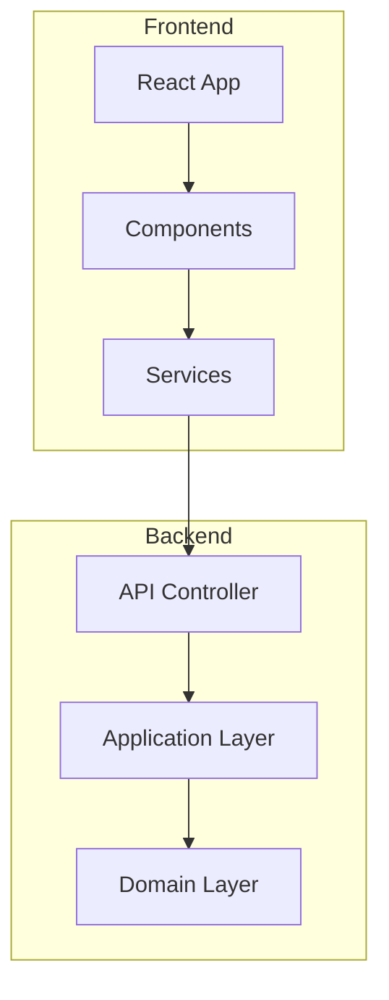

# Generate arc42 Architecture Documentation

Create a comprehensive arc42 architecture documentation for the ghagent-showcase solution. Each section should be in a separate markdown file within a `documentation` folder.

## Pre-Documentation Requirements

1. **Check Existing Documentation First:**
   - **ALWAYS** examine the `documentation/` folder before starting
   - **DO NOT** recreate or overwrite existing documentation files unless explicitly requested
   - **ONLY** create missing sections or update outdated content when necessary
   - If documentation already exists, analyze what's missing or needs updates
   - Preserve existing content and build upon it rather than replacing it

2. **File Creation Policy:**
   - **NEVER** recreate existing files without explicit user request
   - **ALWAYS** check if documentation files already exist
   - **ONLY** generate new files for missing sections
   - When updating existing files, preserve the existing structure and content
   - Add or modify only the necessary parts

## Requirements

1. **Create documentation folder structure (only if missing):**

   ```
   documentation/
   ├── README.md (Table of contents and overview)
   ├── 01-introduction-and-goals.md
   ├── 02-architecture-constraints.md
   ├── 03-system-scope-and-context.md
   ├── 04-solution-strategy.md
   ├── 05-building-block-view.md
   ├── 06-runtime-view.md
   ├── 07-deployment-view.md
   ├── 08-cross-cutting-concepts.md
   ├── 09-architecture-decisions.md
   ├── 10-quality-requirements.md
   ├── 11-risks-and-technical-debts.md
   ├── 12-glossary.md
   └── assets/
       └── (for any additional resources if needed)
   ```

2. **Documentation Standards:**
   - Follow arc42 template structure exactly
   - Use consistent markdown formatting
   - **ALL visualizations must use Mermaid diagrams** - no other diagram formats
   - Reference actual files in the workspace using relative paths
   - Keep each section focused and concise
   - Use tables for structured information
   - Include code examples where relevant
   - **Preserve existing content** and only add/update what's missing

3. **Mermaid Visualization Requirements:**
   - Use appropriate Mermaid diagram types:
     - `graph TB/LR` for architecture overviews
     - `sequenceDiagram` for runtime scenarios
     - `classDiagram` for component relationships
     - `flowchart` for process flows
     - `C4Context` or `graph` for system context
   - Ensure all diagrams are properly formatted with Mermaid syntax
   - Include clear labels and descriptions
   - Use consistent styling and color coding where possible
   - Make diagrams readable and not overly complex

4. **Content Guidelines:**
   - Document the .NET Core backend and React frontend architecture
   - Focus on the clean architecture implementation
   - Include security considerations (even if minimal for showcase)
   - Document the health check functionality as primary use case
   - Reference the coding guidelines from .github/copilot-instructions.md
   - Include TypeScript best practices from .github/instructions/typescript.instructions.md
   - Follow the established branch policy and development practices

5. **Cross-references:**
   - Each section should link to related sections
   - Include file path references to actual code
   - Link to external documentation where applicable
   - Create navigation between sections

6. **Technical Details:**
   - Document the Vite configuration for frontend (port 5173)
   - Explain the .NET Core minimal API setup (port 5000)
   - Detail the CORS configuration
   - Describe the component architecture
   - Include deployment considerations
   - Reference the clean architecture structure

## Workflow

1. **First Step - Inventory Check:**
   - List all existing files in the `documentation/` folder
   - Identify which arc42 sections are already documented
   - Note any outdated or incomplete sections
   - Report findings before proceeding

2. **Second Step - Gap Analysis:**
   - Determine which sections need to be created
   - Identify which sections need updates
   - Plan the documentation work without duplicating existing content

3. **Third Step - Selective Generation:**
   - **ONLY** create files that don't exist
   - **ONLY** update files that are explicitly outdated or incomplete
   - Preserve all existing valuable content

## Expected Output

Generate **ONLY** the missing or outdated files with:

- Proper markdown formatting
- Consistent section numbering
- Cross-references between sections
- Code examples and file references
- **Mermaid diagrams for ALL architecture visualizations**
- Tables for structured information
- Professional technical writing style
- Compliance with the provided coding guidelines

Each file should be complete and standalone while maintaining coherence across the entire documentation set. All diagrams must be created using Mermaid syntax only.

## Example Mermaid Usage



Ensure all architectural visualizations follow this Mermaid-only approach.

**Remember: Check first, preserve existing content, create only what's missing or explicitly needs updating.**
