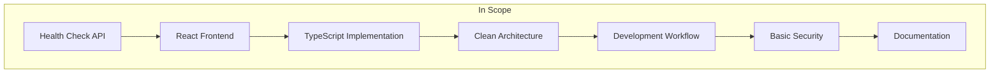

# 1. Introduction and Goals

## 1.1 Requirements Overview

The ghagent-showcase is a demonstration application that showcases a full-stack solution with a .NET Core backend and a React frontend. The application serves as a reference implementation for modern web development practices and clean architecture principles.

### Primary Goals

- **Demonstrate Clean Architecture**: Implement proper separation of concerns across domain, application, infrastructure, and presentation layers
- **Showcase Modern Web Technologies**: Utilize the latest versions of .NET Core and React with TypeScript
- **Establish Best Practices**: Provide a foundation for scalable, maintainable applications
- **Enable Developer Learning**: Serve as a reference for proper code organization and development patterns

### Functional Requirements

- Health check functionality to verify backend-frontend connectivity
- RESTful API endpoint for health monitoring
- Responsive web interface with dark mode design
- Real-time status indicators for system health
- Console logging for debugging and monitoring

### Non-Functional Requirements

- Clean, maintainable code structure
- Fast development workflow with hot reloading
- Type-safe development with TypeScript
- Cross-platform compatibility
- Minimal security implementation (showcase context)

## 1.2 Quality Goals

| Priority | Quality Goal | Description | Metrics |
|----------|--------------|-------------|---------|
| 1 | **Maintainability** | Clean code structure with clear separation of concerns | Code coverage, cyclomatic complexity |
| 2 | **Security** | Follow security best practices within showcase constraints | Security audit results |
| 3 | **Performance** | Responsive user interface and efficient API calls | Response times < 100ms |
| 4 | **Usability** | Intuitive health monitoring dashboard | User feedback, task completion rates |
| 5 | **Portability** | Cross-platform deployment capabilities | Platform compatibility tests |

## 1.3 Stakeholders

### Primary Stakeholders

| Role | Expectations | Contact/Notes |
|------|-------------|---------------|
| **Developers** | Clean, maintainable code with comprehensive documentation | Internal development team |
| **Architects** | Proper implementation of clean architecture patterns | Technical leadership |
| **DevOps Engineers** | Easy deployment and monitoring capabilities | Infrastructure team |

### Secondary Stakeholders

| Role | Expectations | Contact/Notes |
|------|-------------|---------------|
| **Code Reviewers** | Adherence to coding standards and best practices | Peer review process |
| **Students/Learners** | Educational value and clear examples | External learning community |
| **Future Maintainers** | Well-documented, understandable codebase | Future development teams |

## 1.4 Success Criteria

### Technical Success Criteria

- ✅ Clean architecture implementation with proper layer separation
- ✅ TypeScript integration with zero compilation errors
- ✅ Automated health check functionality
- ✅ Responsive design working on multiple screen sizes
- ✅ Console logging providing detailed API call information

### Quality Success Criteria

- Code follows established coding guidelines (see [`/.github/copilot-instructions.md`](../.github/copilot-instructions.md))
- TypeScript best practices implemented (see [`/.github/instructions/typescript.instructions.md`](../.github/instructions/typescript.instructions.md))
- No security vulnerabilities in dependencies
- Fast build times (< 30 seconds for frontend)
- Comprehensive documentation coverage

## 1.5 Project Scope

### In Scope

- Health check REST API endpoint
- React-based frontend with TypeScript
- Clean architecture backend structure
- Development environment setup
- Basic CORS configuration
- Comprehensive documentation

### Out of Scope

- User authentication and authorization
- Database persistence (using in-memory storage)
- Production deployment configuration
- Advanced security features
- Performance optimization for large-scale usage
- Multi-tenant capabilities

---

**Navigation:** [← README](README.md) | [Architecture Constraints →](02-architecture-constraints.md)