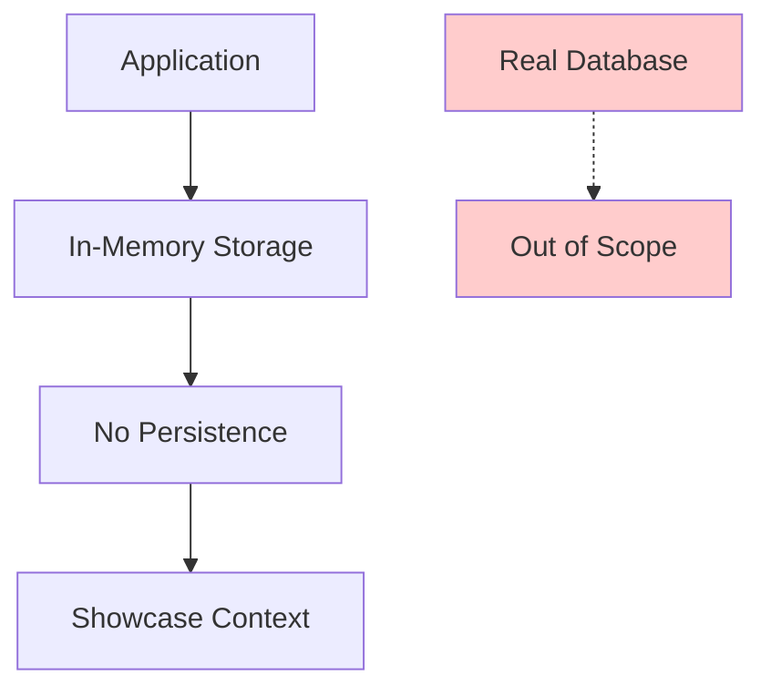
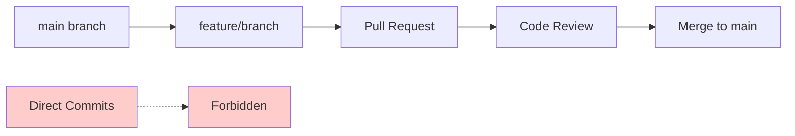
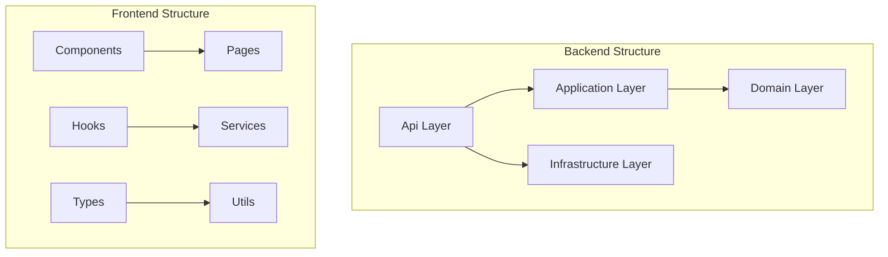
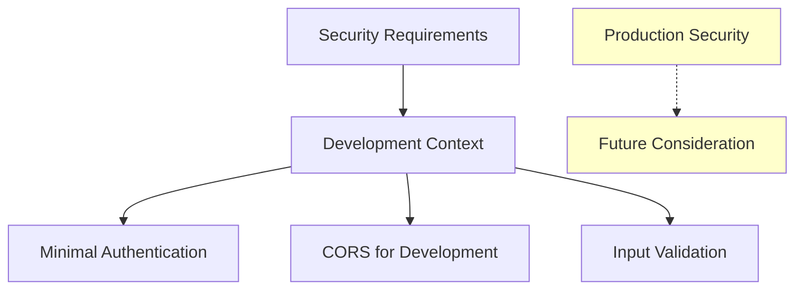
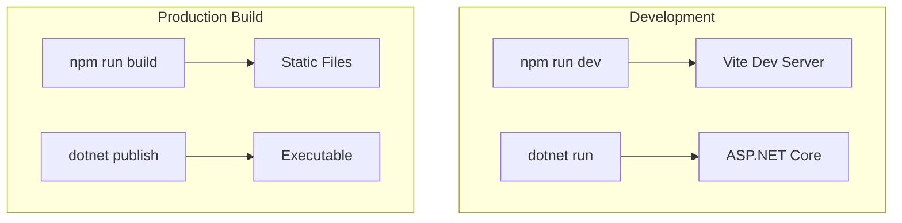

# 2. Architecture Constraints

## 2.1 Technical Constraints

### Technology Stack Constraints

| Constraint | Description | Rationale |
|------------|-------------|-----------|
| **.NET 9.0** | Backend must use the latest .NET version | Leverage latest features and performance improvements |
| **TypeScript 5.x** | Frontend must use modern TypeScript | Type safety and developer experience |
| **ES2022** | Target modern JavaScript features | Modern browser support and latest language features |
| **React 19** | Use latest React version with hooks | Modern component patterns and performance |
| **Vite Build Tool** | Use Vite for frontend development | Fast development server and build performance |

### Data Storage Constraints

| Constraint | Description | Impact |
|------------|-------------|--------|
| **In-Memory Storage** | No real database for showcase purposes | Data is lost on application restart |
| **No Persistence** | All data stored in application memory | Simplified deployment and setup |
| **Stateless Design** | Backend services should be stateless where possible | Easier scaling and testing |

### Development Environment Constraints

| Constraint | Type | Description |
|------------|------|-------------|
| **Local Development** | Environment | Primary development on local machines |
| **CORS Configuration** | Security | Development-friendly CORS for frontend-backend communication |
| **Port Allocation** | Network | Frontend on 5173, Backend on 5000 |
| **Hot Reloading** | Performance | Development servers must support hot module replacement |

## 2.2 Organizational Constraints

### Development Process Constraints

| Constraint | Description | Enforcement |
|------------|-------------|-------------|
| **Branch Strategy** | Feature branches from main, no direct commits to main | Git branch protection rules |
| **Code Review** | All changes require review before merge | Pull request process |
| **Coding Standards** | Follow established guidelines | Automated linting and formatting |

### Resource Constraints

| Resource | Constraint | Impact |
|----------|------------|--------|
| **Development Time** | Focused on core functionality | Prioritize essential features |
| **Complexity** | Keep solutions simple over complex | Avoid over-engineering |
| **Dependencies** | Minimize external dependencies | Reduce security and maintenance burden |

## 2.3 Convention Constraints

### Code Organization

Based on [`/.github/copilot-instructions.md`](../.github/copilot-instructions.md):

### Naming Conventions

| Component | Convention | Example |
|-----------|------------|---------|
| **React Components** | PascalCase | `HealthCheck.tsx` |
| **Hooks** | camelCase with 'use' prefix | `useHealthCheck.ts` |
| **Services** | camelCase with Service suffix | `healthService.ts` |
| **Types** | PascalCase interfaces | `HealthResponse` |
| **API Endpoints** | kebab-case | `/api/health` |

### Architecture Patterns

| Pattern | Application | Constraint |
|---------|-------------|------------|
| **Clean Architecture** | Backend organization | Mandatory for backend structure |
| **Single Responsibility** | All components | Each class/function has one responsibility |
| **Dependency Injection** | Backend services | Use .NET Core built-in DI container |
| **Custom Hooks** | Frontend logic | Extract reusable logic into hooks |

## 2.4 Legal and Compliance Constraints

### Security Constraints

| Constraint | Description | Implementation |
|------------|-------------|----------------|
| **Showcase Context** | Security measures appropriate for demonstration | No real authentication required |
| **CORS Policy** | Permissive CORS for development | Restricted in production deployment |
| **Input Validation** | Basic validation for API inputs | Model validation in controllers |
| **Dependency Security** | Regular security audits of packages | Automated vulnerability scanning |

### Licensing Constraints

| Component | License | Constraint |
|-----------|---------|------------|
| **.NET Core** | MIT License | Free for commercial and non-commercial use |
| **React** | MIT License | Free for commercial and non-commercial use |
| **TypeScript** | Apache 2.0 | Free for commercial and non-commercial use |
| **Vite** | MIT License | Free for commercial and non-commercial use |

## 2.5 Technology Platform Constraints

### Runtime Environment

| Platform | Version | Support Level |
|----------|---------|---------------|
| **Node.js** | 18+ | Required for frontend development |
| **.NET Runtime** | 9.0+ | Required for backend execution |
| **Browsers** | Modern browsers (Chrome, Firefox, Safari, Edge) | Target ES2022 support |
| **Operating Systems** | Windows, macOS, Linux | Cross-platform development |

### Build and Deployment

| Constraint | Description | Impact |
|------------|-------------|--------|
| **Build Tools** | Vite for frontend, .NET CLI for backend | Standardized build process |
| **Package Management** | npm for frontend, NuGet for backend | Dependency management |
| **Hot Reloading** | Development servers must support HMR | Fast development feedback |

---

**Navigation:** [← Introduction and Goals](01-introduction-and-goals.md) | [System Scope and Context →](03-system-scope-and-context.md)