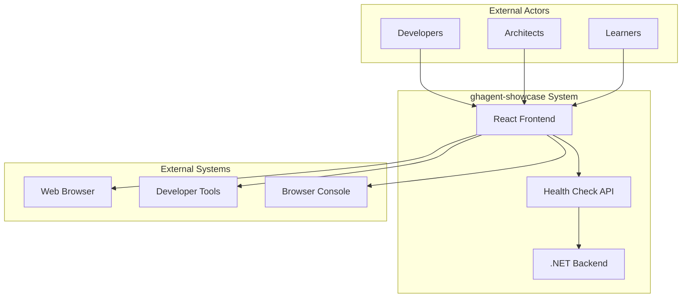
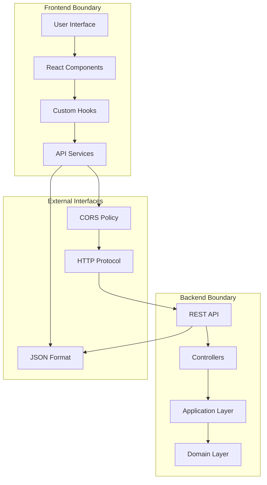
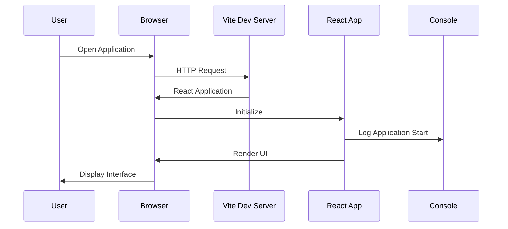
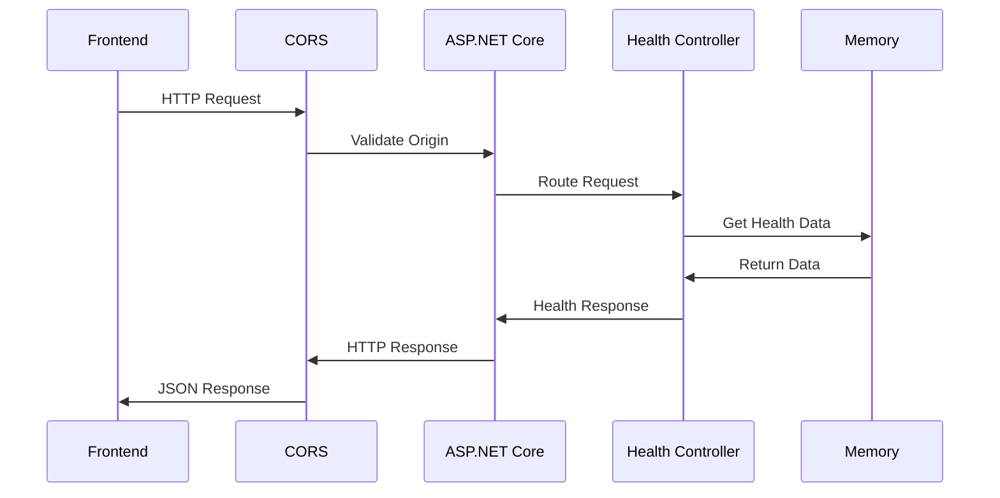
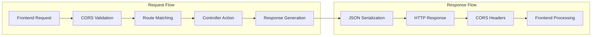
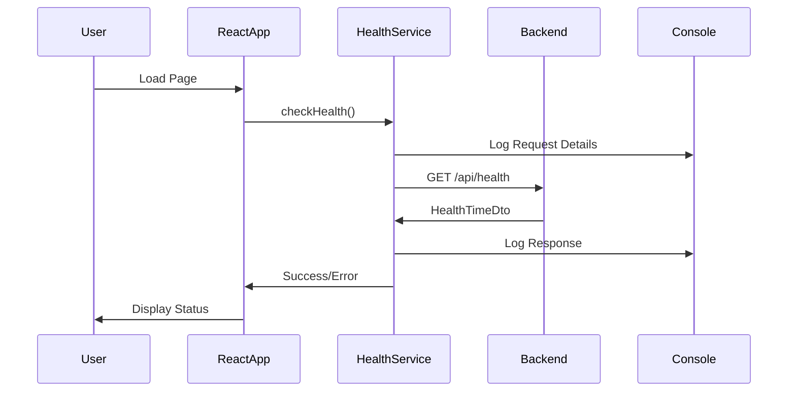
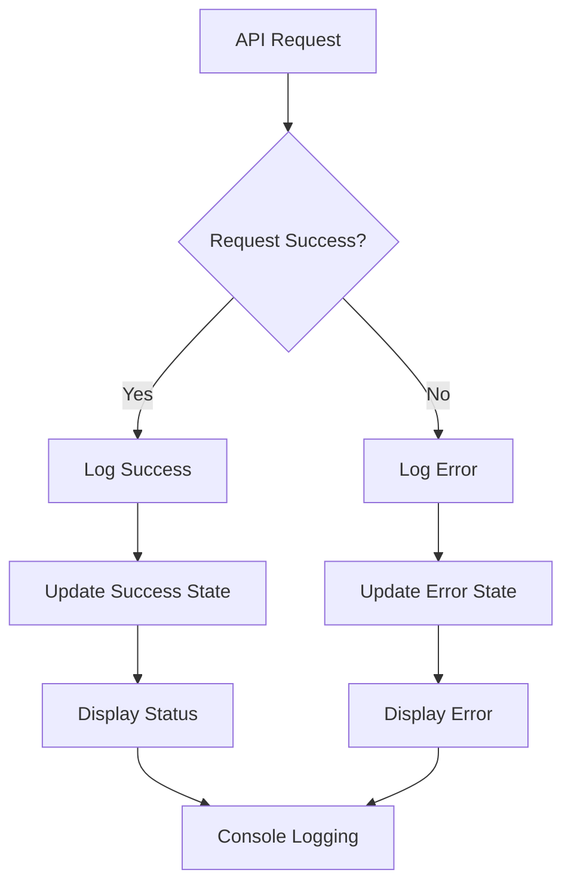
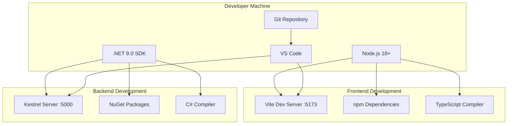

# 3. System Scope and Context

## 3.1 Business Context

The ghagent-showcase application operates within a development and demonstration context, providing a reference implementation for modern full-stack web development.



### Business Context Description

| Actor/System | Interface | Purpose |
|--------------|-----------|---------|
| **Developers** | Web Interface | Use as reference implementation for clean architecture |
| **Architects** | Web Interface | Evaluate architectural patterns and decisions |
| **Learners** | Web Interface | Study modern web development practices |
| **Web Browser** | HTTP/HTTPS | Render React application and handle user interactions |
| **Developer Tools** | Browser APIs | Debug and monitor application behavior |
| **Browser Console** | Console API | Display detailed API call logs and debugging information |

## 3.2 Technical Context

### System Boundaries



### Technical Interfaces

| Interface | Technology | Protocol | Data Format | Purpose |
|-----------|------------|----------|-------------|---------|
| **Frontend-Backend** | HTTP REST | HTTP/1.1 | JSON | API communication |
| **User Interface** | React/DOM | Browser APIs | HTML/CSS/JS | User interaction |
| **Development** | Vite/WebSocket | WebSocket | HMR Protocol | Hot module replacement |
| **Console Logging** | Browser Console API | JavaScript | Text/Objects | Debugging and monitoring |

## 3.3 External Interfaces

### Frontend External Interfaces



#### Frontend Interface Details

| Interface | Description | Technology | Port |
|-----------|-------------|------------|------|
| **HTTP Server** | Serves React application | Vite Development Server | 5173 |
| **WebSocket** | Hot module replacement | Vite HMR | 5173 |
| **Browser APIs** | DOM manipulation, Console logging | Web Standards | N/A |
| **Fetch API** | HTTP requests to backend | Web Standards | N/A |

### Backend External Interfaces



#### Backend Interface Details

| Interface | Description | Technology | Port |
|-----------|-------------|------------|------|
| **REST API** | HTTP endpoints for frontend | ASP.NET Core | 5000 |
| **CORS** | Cross-origin resource sharing | ASP.NET Core CORS | 5000 |
| **Swagger UI** | API documentation | Swagger/OpenAPI | 5000 |
| **Health Endpoint** | System health monitoring | ASP.NET Core | 5000 |

## 3.4 Communication Protocols

### HTTP REST API Protocol



#### API Specification

| Endpoint | Method | Request | Response | Purpose |
|----------|--------|---------|----------|---------|
| `/api/health` | GET | None | `HealthTimeDto` | System health check |
| `/swagger` | GET | None | HTML | API documentation |
| `/` | GET | None | Swagger UI | Interactive API explorer |

#### Health Check API Contract

```json
{
  "endpoint": "/api/health",
  "method": "GET",
  "response": {
    "utcNow": "2024-10-17T09:30:00.000Z",
    "status": "OK"
  },
  "statusCodes": {
    "200": "Success",
    "500": "Internal Server Error"
  }
}
```

## 3.5 Data Flow Context

### Request-Response Flow



### Error Handling Flow



## 3.6 Development Context

### Development Environment Setup



### Development Workflow Context

| Stage | Technology | Purpose | Port/Protocol |
|-------|------------|---------|---------------|
| **Code Editing** | VS Code | Development environment | File System |
| **Frontend Build** | Vite | Fast development builds | HTTP :5173 |
| **Backend Build** | .NET CLI | Compilation and execution | HTTP :5000 |
| **Version Control** | Git | Source code management | Git Protocol |
| **Hot Reloading** | Vite HMR | Live code updates | WebSocket |

---

**Navigation:** [← Architecture Constraints](02-architecture-constraints.md) | [Solution Strategy →](04-solution-strategy.md)