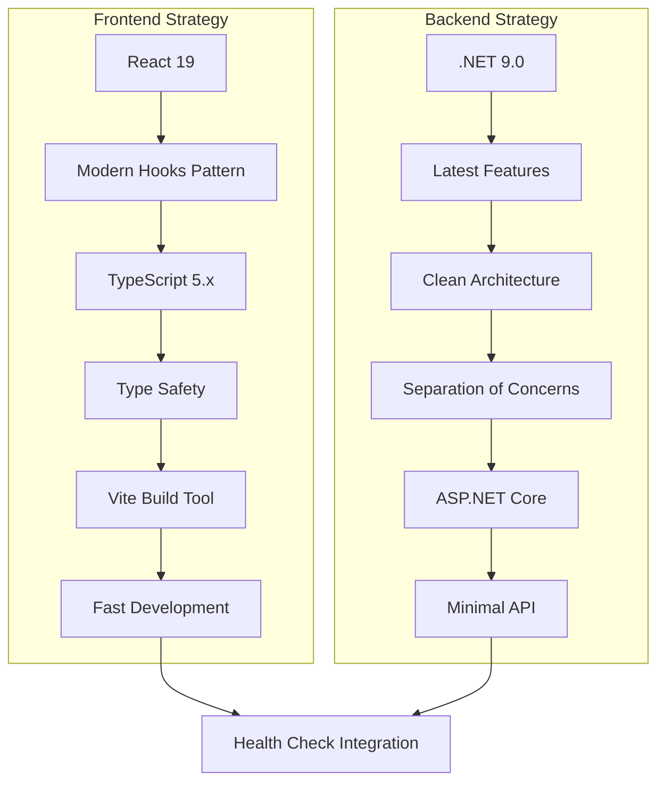
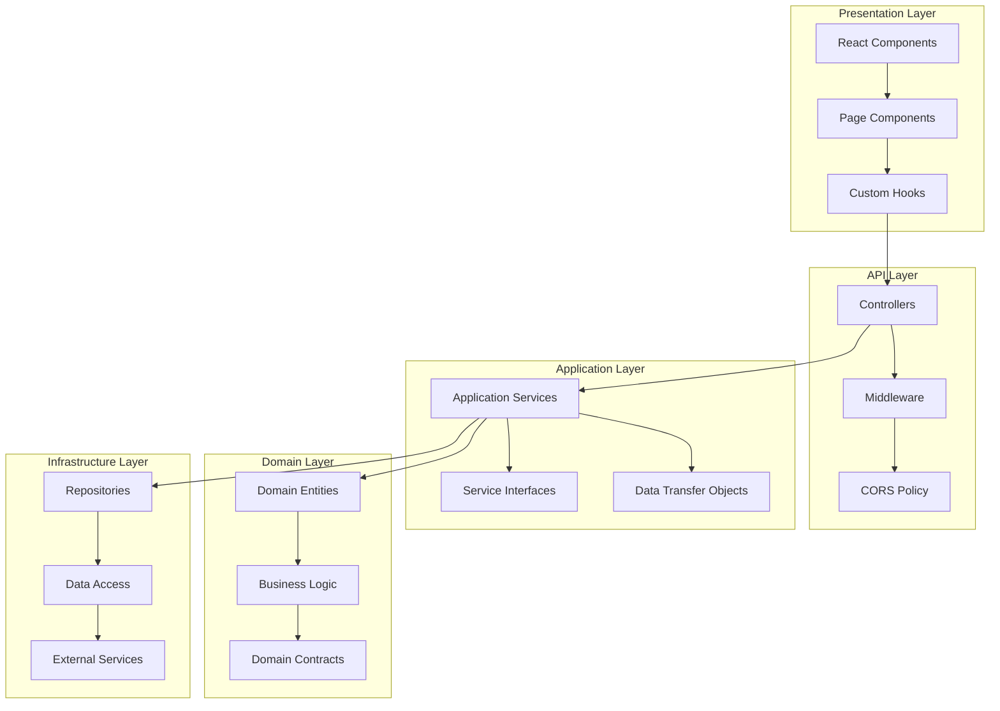
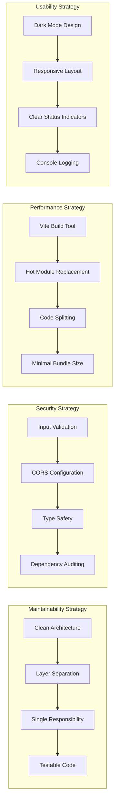
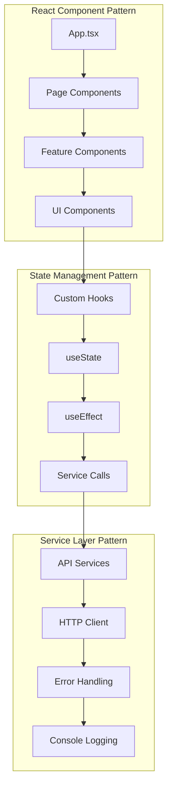
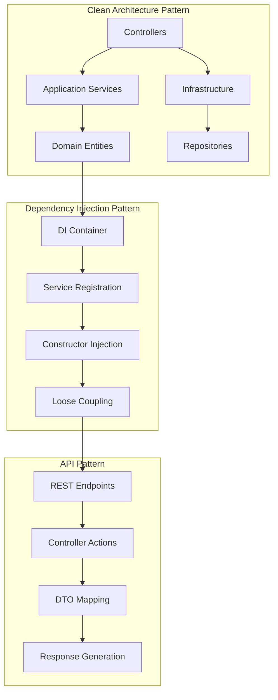
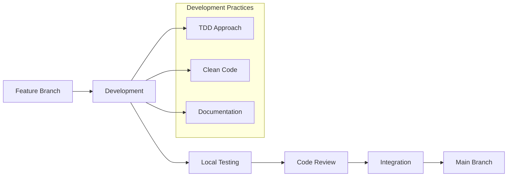
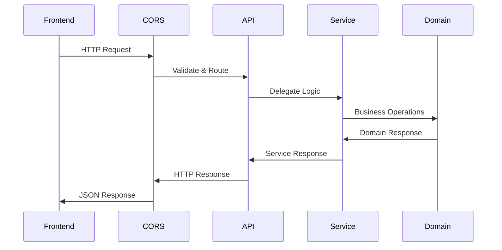
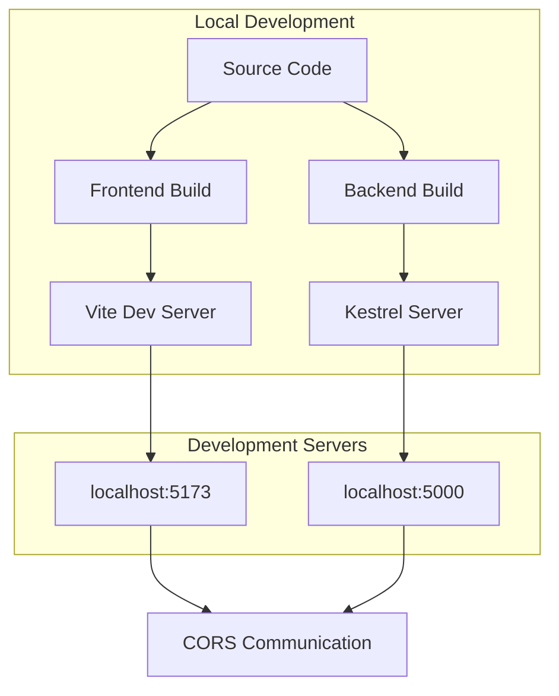

# 4. Solution Strategy

## 4.1 Technology Decisions

### Strategic Technology Choices

### Technology Rationale

| Technology | Decision Rationale | Alternatives Considered |
|------------|-------------------|------------------------|
| **React 19** | Latest features, excellent TypeScript support, large ecosystem | Vue.js, Angular, Svelte |
| **.NET 9.0** | Latest framework, performance improvements, LTS support | Node.js, Java Spring, Python |
| **TypeScript** | Type safety, better developer experience, tooling support | Plain JavaScript, Flow |
| **Vite** | Fast build times, excellent HMR, modern tooling | Create React App, Webpack |
| **Clean Architecture** | Maintainability, testability, separation of concerns | MVC, N-tier, Hexagonal |

## 4.2 Top-level Decomposition

### Architectural Layers

### Component Organization Strategy

| Layer | Responsibility | Key Components | File Location |
|-------|----------------|----------------|---------------|
| **Frontend Presentation** | User interface and interaction | Components, Pages, Hooks | [`/frontend/src/`](../frontend/src/) |
| **Frontend Services** | API communication | Services, Types | [`/frontend/src/services/`](../frontend/src/services/) |
| **Backend API** | HTTP request handling | Controllers, Middleware | [`/backend/src/Api/`](../backend/src/Api/) |
| **Backend Application** | Business logic coordination | Services, DTOs | [`/backend/src/Application/`](../backend/src/Application/) |
| **Backend Domain** | Core business rules | Entities, Domain Logic | [`/backend/src/Domain/`](../backend/src/Domain/) |
| **Backend Infrastructure** | Data access, external services | Repositories, External APIs | [`/backend/src/Infrastructure/`](../backend/src/Infrastructure/) |

## 4.3 Quality Goals Achievement

### Quality Strategy Mapping

### Quality Implementation Approach

| Quality Goal | Strategy | Implementation | Verification |
|--------------|----------|----------------|--------------|
| **Maintainability** | Clean Architecture | Layer separation, SRP, DI | Code reviews, architecture tests |
| **Security** | Defense in depth | Input validation, CORS, TypeScript | Security audits, dependency scans |
| **Performance** | Fast development cycle | Vite, HMR, minimal dependencies | Build time metrics, bundle analysis |
| **Usability** | User-centered design | Dark theme, responsive design, clear feedback | User testing, accessibility checks |
| **Portability** | Cross-platform approach | .NET Core, modern web standards | Multi-platform testing |

## 4.4 Solution Patterns

### Frontend Architecture Pattern

#### Frontend Pattern Details

| Pattern | Application | Benefits | Implementation |
|---------|-------------|----------|----------------|
| **Custom Hooks** | Business logic extraction | Reusability, testability | [`useHealthCheck.ts`](../frontend/src/hooks/useHealthCheck.ts) |
| **Service Layer** | API communication | Centralized HTTP logic | [`healthService.ts`](../frontend/src/services/healthService.ts) |
| **Component Composition** | UI structure | Modularity, reusability | [`HealthCheck.tsx`](../frontend/src/components/HealthCheck.tsx) |
| **Type-Safe APIs** | Contract definition | Compile-time validation | [`health.ts`](../frontend/src/types/health.ts) |

### Backend Architecture Pattern

#### Backend Pattern Details

| Pattern | Application | Benefits | Implementation |
|---------|-------------|----------|----------------|
| **Clean Architecture** | Overall structure | Testability, maintainability | Layer separation in [`/backend/src/`](../backend/src/) |
| **Repository Pattern** | Data access abstraction | Testability, flexibility | Repository interfaces and implementations |
| **DTO Pattern** | Data transfer | API contract definition | [`HealthTimeDto.cs`](../backend/src/Application/DTOs/HealthTimeDto.cs) |
| **Controller Pattern** | HTTP concerns | Separation of web and business logic | [`HealthController.cs`](../backend/src/Api/Controllers/HealthController.cs) |

## 4.5 Development Strategy

### Development Workflow Strategy

### Best Practices Implementation

| Practice | Implementation | Tooling | Verification |
|----------|----------------|---------|--------------|
| **Code Quality** | ESLint, TypeScript strict mode | Automated linting | CI/CD checks |
| **Documentation** | Inline comments, README files | Markdown, JSDoc | Documentation reviews |
| **Testing Strategy** | Unit tests, integration tests | Jest, .NET Test Framework | Automated test runs |
| **Version Control** | Feature branches, pull requests | Git, GitHub | Branch protection rules |

## 4.6 Integration Strategy

### Frontend-Backend Integration

### Integration Approach

| Integration Point | Strategy | Implementation | Benefits |
|-------------------|----------|----------------|----------|
| **API Communication** | REST over HTTP | JSON serialization | Standard, well-supported |
| **CORS Handling** | Backend configuration | ASP.NET Core CORS middleware | Secure cross-origin requests |
| **Error Handling** | Consistent error responses | Global exception handling | Predictable error behavior |
| **Logging Integration** | Centralized logging | Console and server logs | Comprehensive debugging |

## 4.7 Deployment Strategy

### Development Deployment

### Production Considerations

| Aspect | Development | Production Considerations |
|--------|-------------|--------------------------|
| **Frontend Serving** | Vite dev server | Static file hosting, CDN |
| **Backend Hosting** | Local Kestrel | IIS, Docker, cloud hosting |
| **CORS Policy** | Permissive | Restrictive, specific origins |
| **Logging** | Console output | Structured logging, monitoring |
| **Security** | Development-friendly | Production hardening required |

---

**Navigation:** [← System Scope and Context](03-system-scope-and-context.md) | [Building Block View →](05-building-block-view.md)