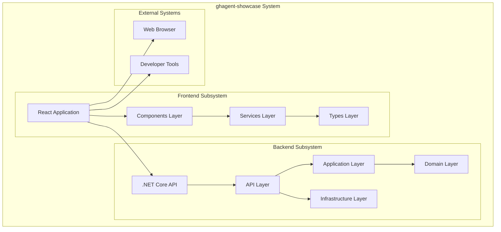
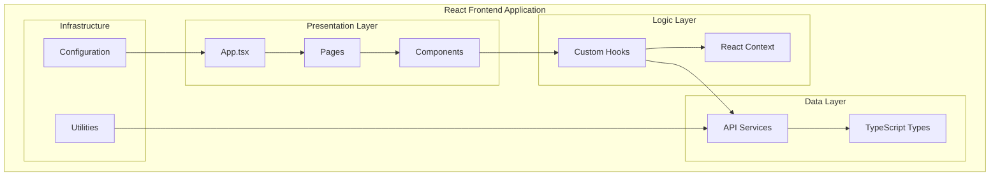
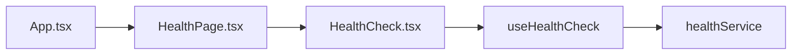
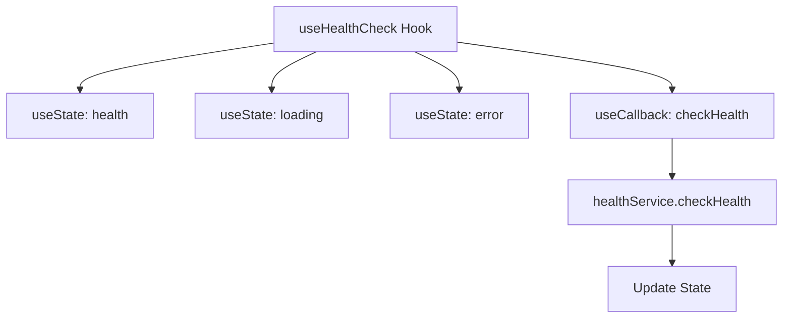
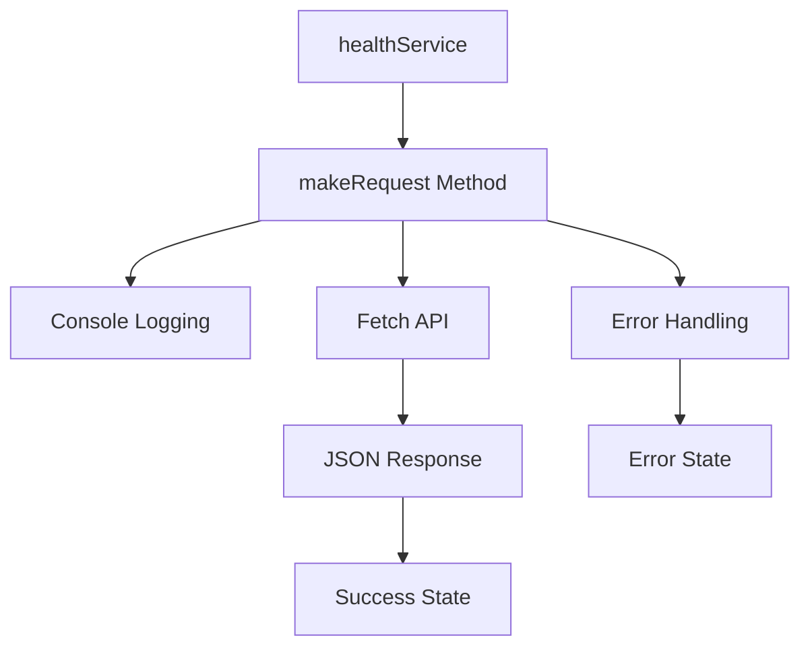
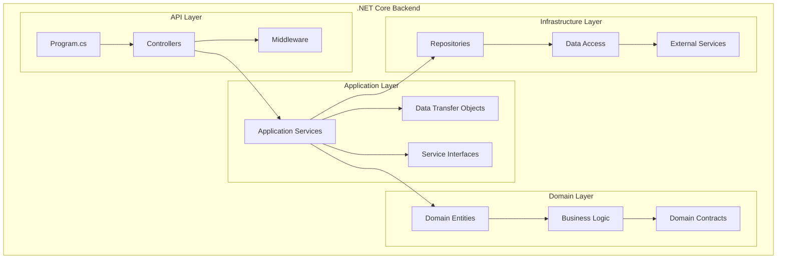
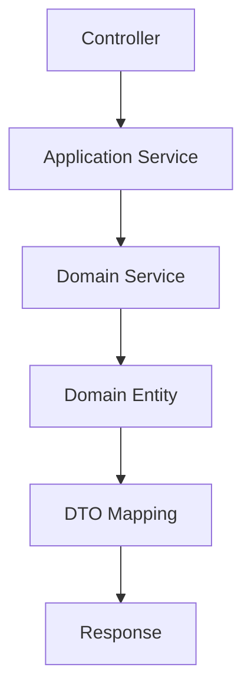
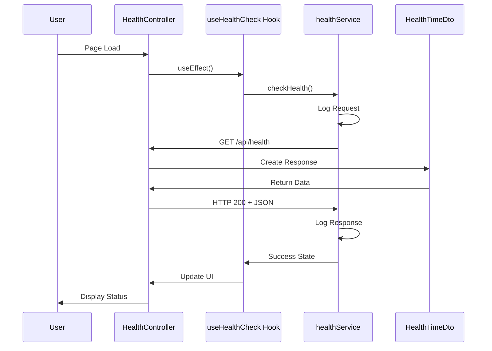
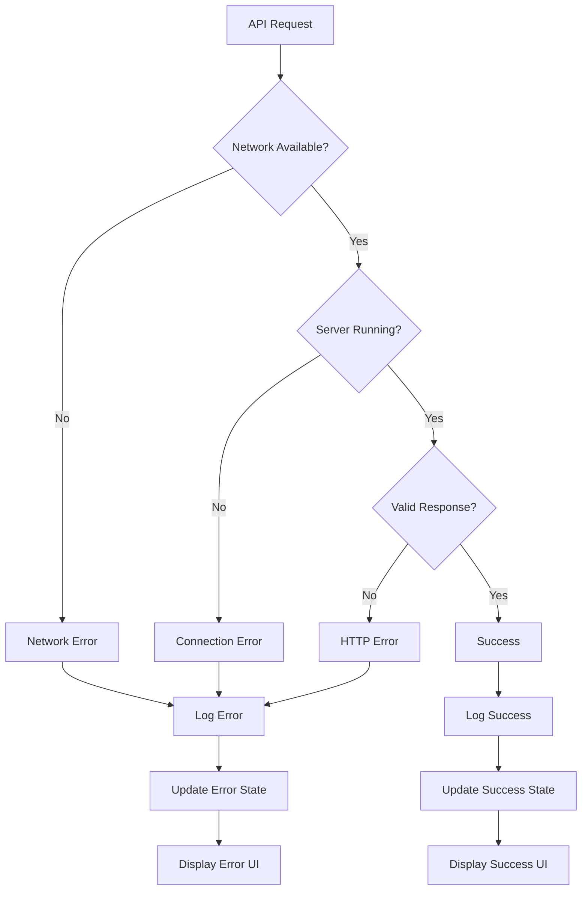

# 5. Building Block View

## 5.1 Whitebox Overall System

The ghagent-showcase system consists of two main subsystems: a React frontend and a .NET Core backend, communicating via HTTP REST API.



### System Components Overview

| Component | Responsibility | Technology | Key Files |
|-----------|----------------|------------|-----------|
| **React Frontend** | User interface and client-side logic | React 19 + TypeScript | [`/frontend/src/`](../frontend/src/) |
| **.NET Backend** | Business logic and data management | .NET 9.0 + ASP.NET Core | [`/backend/src/`](../backend/src/) |
| **HTTP API** | Communication interface | REST over HTTP/JSON | Controllers and Services |
| **Development Tools** | Build and development support | Vite, .NET CLI | Configuration files |

## 5.2 Frontend Building Blocks (Level 2)

### Frontend Architecture Whitebox



### Frontend Components Detail

#### 5.2.1 Presentation Layer

| Component | Purpose | Responsibility | File Path |
|-----------|---------|----------------|-----------|
| **App.tsx** | Root application component | Application structure and routing | [`/frontend/src/App.tsx`](../frontend/src/App.tsx) |
| **HealthPage** | Main page component | Page layout and health dashboard | [`/frontend/src/pages/HealthPage.tsx`](../frontend/src/pages/HealthPage.tsx) |
| **HealthCheck** | Health monitoring component | Display health status and controls | [`/frontend/src/components/HealthCheck.tsx`](../frontend/src/components/HealthCheck.tsx) |

**Component Interaction:**



#### 5.2.2 Logic Layer

| Component | Purpose | Responsibility | File Path |
|-----------|---------|----------------|-----------|
| **useHealthCheck** | Custom hook for health logic | State management and API calls | [`/frontend/src/hooks/useHealthCheck.ts`](../frontend/src/hooks/useHealthCheck.ts) |

**Hook Architecture:**



#### 5.2.3 Data Layer

| Component | Purpose | Responsibility | File Path |
|-----------|---------|----------------|-----------|
| **healthService** | API communication service | HTTP requests and response handling | [`/frontend/src/services/healthService.ts`](../frontend/src/services/healthService.ts) |
| **HealthResponse** | Type definition for API response | Type safety for health data | [`/frontend/src/types/health.ts`](../frontend/src/types/health.ts) |

**Service Architecture:**



## 5.3 Backend Building Blocks (Level 2)

### Backend Architecture Whitebox



### Backend Components Detail

#### 5.3.1 API Layer

| Component | Purpose | Responsibility | File Path |
|-----------|---------|----------------|-----------|
| **Program.cs** | Application entry point | Service configuration, middleware setup | [`/backend/src/Api/Program.cs`](../backend/src/Api/Program.cs) |
| **HealthController** | Health endpoint controller | HTTP request handling for health checks | [`/backend/src/Api/Controllers/HealthController.cs`](../backend/src/Api/Controllers/HealthController.cs) |

**API Layer Architecture:**


#### 5.3.2 Application Layer

| Component | Purpose | Responsibility | File Path |
|-----------|---------|----------------|-----------|
| **HealthTimeDto** | Data transfer object | API response contract | [`/backend/src/Application/DTOs/HealthTimeDto.cs`](../backend/src/Application/DTOs/HealthTimeDto.cs) |

**Application Layer Pattern:**



#### 5.3.3 Domain Layer

| Component | Purpose | Responsibility | File Path |
|-----------|---------|----------------|-----------|
| **Domain Entities** | Core business objects | Business logic and rules | [`/backend/src/Domain/Entities/`](../backend/src/Domain/Entities/) |

#### 5.3.4 Infrastructure Layer

| Component | Purpose | Responsibility | File Path |
|-----------|---------|----------------|-----------|
| **Repositories** | Data access abstraction | Data persistence operations | [`/backend/src/Infrastructure/Repositories/`](../backend/src/Infrastructure/Repositories/) |

## 5.4 Component Interaction (Level 3)

### Health Check Flow Detail



### Error Handling Flow Detail



## 5.5 File Organization Structure

### Frontend File Structure

```
frontend/src/
├── components/              # Reusable UI components
│   ├── HealthCheck.tsx      # Main health monitoring component
│   └── index.ts             # Component exports
├── pages/                   # Page-level components
│   ├── HealthPage.tsx       # Health dashboard page
│   └── index.ts             # Page exports
├── hooks/                   # Custom React hooks
│   ├── useHealthCheck.ts    # Health check business logic
│   └── index.ts             # Hook exports
├── services/                # API communication layer
│   ├── healthService.ts     # Backend API integration
│   └── index.ts             # Service exports
├── types/                   # TypeScript type definitions
│   ├── health.ts            # Health API types
│   └── index.ts             # Type exports
├── utils/                   # Utility functions
├── App.css                  # Application styles
├── App.tsx                  # Root component
├── index.css                # Global styles
└── main.tsx                 # Application entry point
```

### Backend File Structure

```
backend/src/
├── Api/                     # Web API layer
│   ├── Controllers/         # HTTP controllers
│   │   └── HealthController.cs
│   ├── Properties/          # Launch settings
│   │   └── launchSettings.json
│   ├── Api.csproj          # Project file
│   ├── GlobalUsings.cs     # Global using statements
│   └── Program.cs          # Application entry point
├── Application/             # Application services layer
│   ├── DTOs/               # Data transfer objects
│   │   └── HealthTimeDto.cs
│   ├── Application.csproj  # Project file
│   └── GlobalUsings.cs     # Global using statements
├── Domain/                  # Domain entities and logic
│   ├── Entities/           # Domain entities
│   ├── Domain.csproj       # Project file
│   └── GlobalUsings.cs     # Global using statements
└── Infrastructure/          # Data access and external services
    ├── Repositories/        # Data repositories
    ├── Infrastructure.csproj # Project file
    └── GlobalUsings.cs      # Global using statements
```

## 5.6 Interface Definitions

### Frontend Service Interface

```typescript
interface HealthService {
  checkHealth(): Promise<HealthResponse>;
}

interface HealthResponse {
  utcNow: string;
  status: string;
}
```

### Backend API Interface

```csharp
[ApiController]
[Route("api/[controller]")]
public interface IHealthController
{
    ActionResult<HealthTimeDto> Get();
}

public record HealthTimeDto(DateTime UtcNow, string Status);
```

### Component Props Interface

```typescript
interface HealthCheckProps {
  // Component is self-contained, no props required
}

interface UseHealthCheckReturn {
  health: HealthResponse | null;
  loading: boolean;
  error: string | null;
  checkHealth: () => Promise<void>;
}
```

---

**Navigation:** [← Solution Strategy](04-solution-strategy.md) | [Runtime View →](06-runtime-view.md)