# 6. Runtime View

## 6.1 Health Check Scenario

This section describes the runtime behavior of the health check functionality, which is the primary use case of the application.

### 6.1.1 Successful Health Check Flow

```mermaid
sequenceDiagram
    participant User
    participant Browser
    participant ReactApp
    participant useHealthCheck
    participant healthService
    participant Console
    participant Backend
    
    User->>Browser: Open http://localhost:5173
    Browser->>ReactApp: Load Application
    ReactApp->>useHealthCheck: useEffect() triggers
    useHealthCheck->>healthService: checkHealth()
    
    healthService->>Console: Log "🚀 API Call: GET /api/health"
    healthService->>Backend: HTTP GET /api/health
    Backend->>healthService: HTTP 200 + HealthTimeDto
    healthService->>Console: Log "✅ API Success"
    
    healthService->>useHealthCheck: Return HealthResponse
    useHealthCheck->>ReactApp: Update state (health, loading)
    ReactApp->>Browser: Render success UI
    Browser->>User: Display green status indicator
```



### 6.1.2 Manual Refresh Scenario


## 6.2 Error Handling Scenarios

### 6.2.1 Backend Unavailable Scenario

```mermaid
sequenceDiagram
    participant ReactApp
    participant healthService
    participant Console
    participant Backend
    
    ReactApp->>healthService: checkHealth()
    healthService->>Console: Log request details
    healthService->>Backend: HTTP GET /api/health
    
    Note over Backend: Server not running
    
    Backend--xhealthService: Connection refused
    healthService->>Console: Log "🔥 API Request failed"
    healthService->>ReactApp: Throw connection error
    ReactApp->>ReactApp: Display error state with red indicator
```



### 6.2.2 CORS Error Scenario


## 6.3 State Management Flow

### 6.3.1 Component State Lifecycle


### 6.3.2 Health Check Hook State Flow


## 6.4 Data Flow Runtime Behavior

### 6.4.1 Request Processing Flow


### 6.4.2 Console Logging Flow

```mermaid
sequenceDiagram
    participant Service as healthService
    participant Console as Browser Console
    participant Network as Network Layer
    
    Service->>Console: 🚀 Log request start
    Service->>Console: 📋 Log request details
    Service->>Network: Send HTTP request
    
    alt Successful Response
        Network->>Service: HTTP 200 + Data
        Service->>Console: 📊 Log response status
        Service->>Console: ✅ Log success data
    else Error Response
        Network->>Service: HTTP Error
        Service->>Console: ❌ Log error details
        Service->>Console: 🔥 Log failure info
    end
```



## 6.5 Performance Runtime Characteristics

### 6.5.1 Application Startup Flow

```mermaid
gantt
    title Application Startup Timeline
    dateFormat X
    axisFormat %s
    
    section Frontend
    Vite Dev Server Start    :0, 2s
    React App Bundle Load    :1s, 3s
    Component Mount          :3s, 4s
    Initial Health Check     :4s, 5s
    
    section Backend
    .NET App Start          :0, 3s
    API Ready               :3s, 4s
    First Request Process   :4s, 5s
```

### 6.5.2 Health Check Performance

| Metric | Expected Value | Measurement Point |
|--------|----------------|-------------------|
| **API Response Time** | < 100ms | Backend health endpoint |
| **Frontend Render Time** | < 50ms | Component state update |
| **Total User Feedback** | < 200ms | From click to UI update |
| **Build Time** | < 30s | Vite development build |
| **Hot Reload Time** | < 1s | File change to browser update |

## 6.6 Concurrency and Threading

### 6.6.1 Frontend Concurrency Model


### 6.6.2 Backend Threading Model


## 6.7 Resource Management

### 6.7.1 Memory Usage Pattern


### 6.7.2 Network Resource Usage

| Resource | Usage Pattern | Optimization |
|----------|---------------|--------------|
| **HTTP Connections** | One request per health check | Connection reuse |
| **Request Payload** | Minimal (GET request) | No optimization needed |
| **Response Payload** | Small JSON object | Efficient serialization |
| **CORS Preflight** | Cached by browser | Standard caching |

---

**Navigation:** [← Building Block View](05-building-block-view.md) | [Deployment View →](07-deployment-view.md)