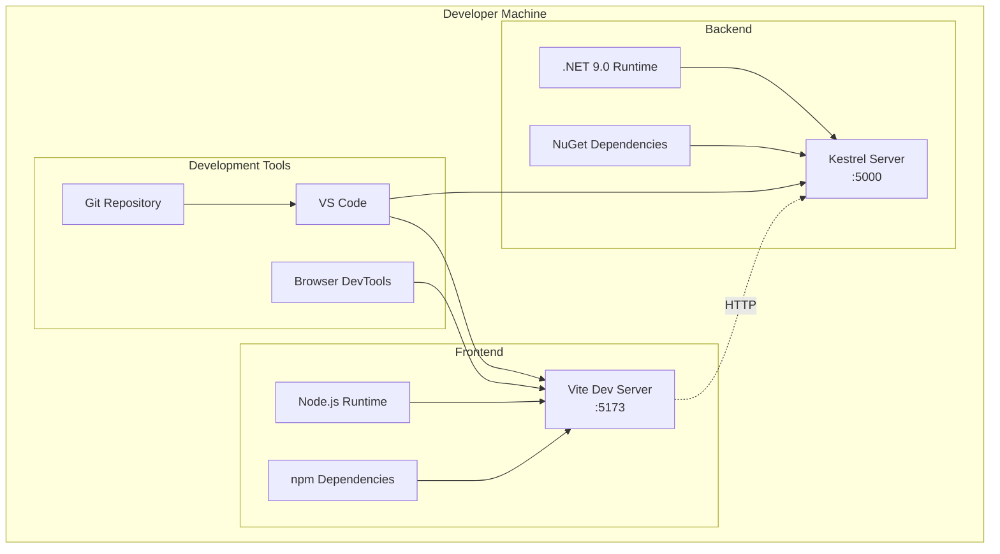
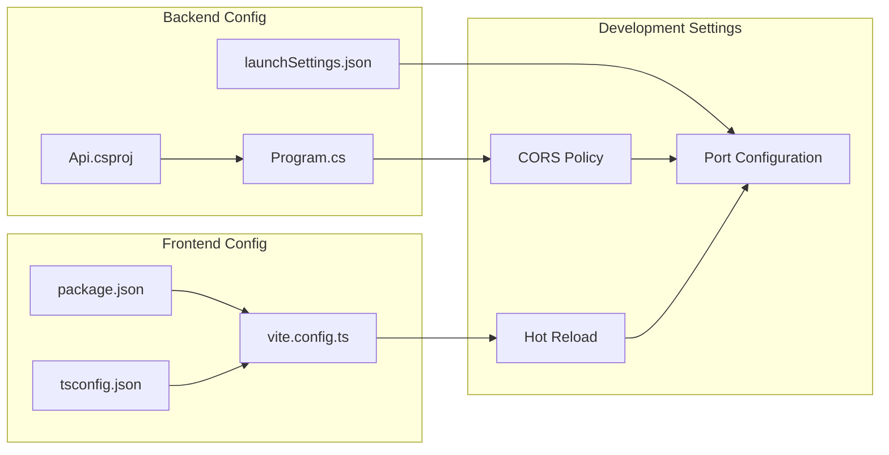
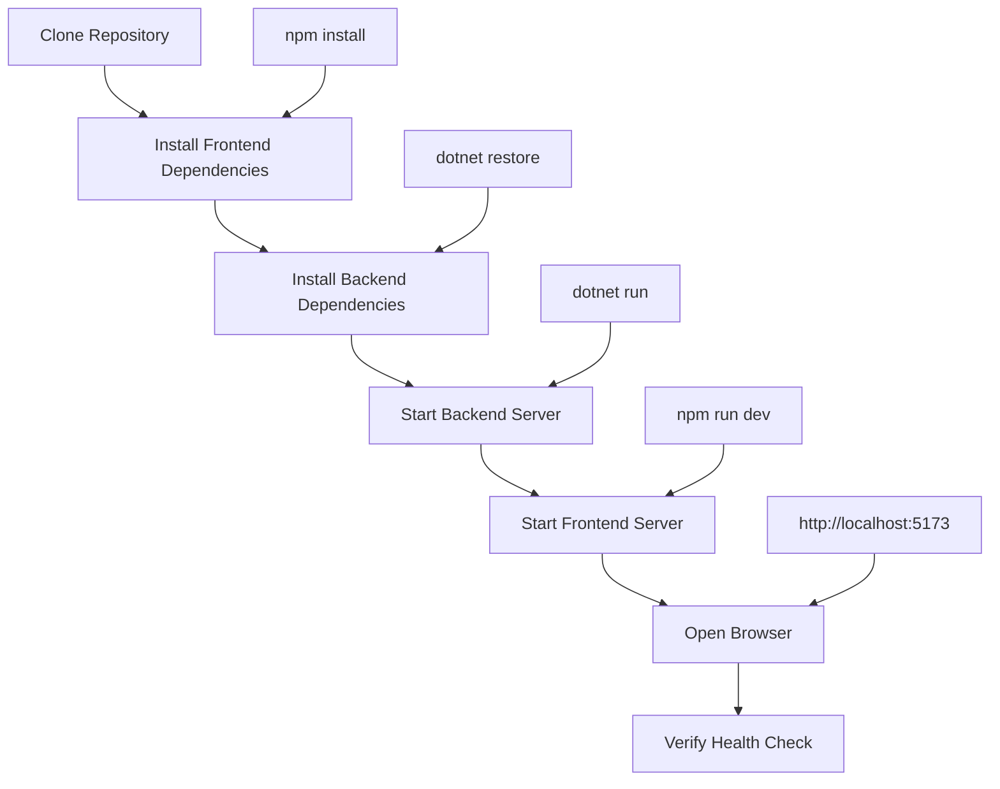
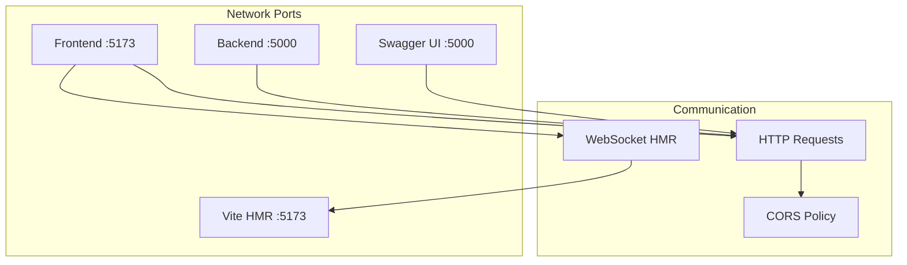
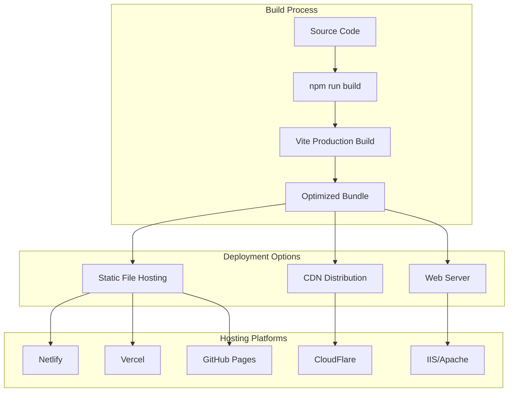
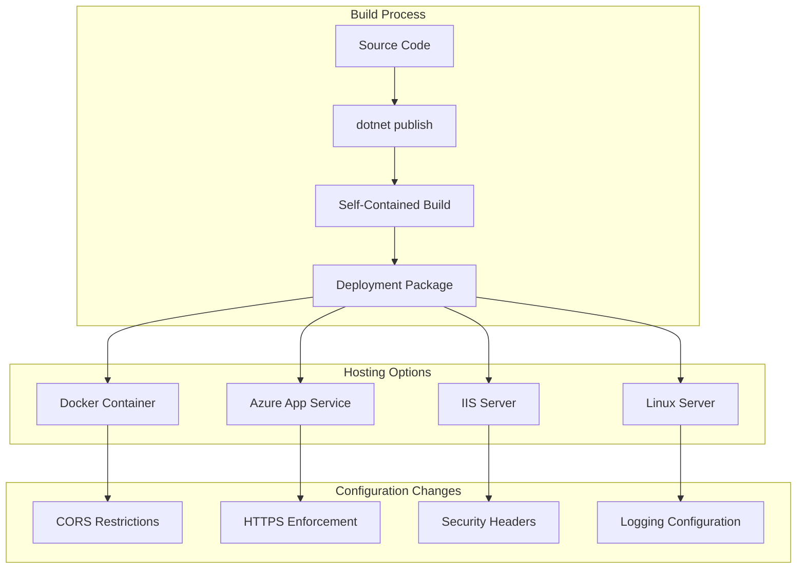
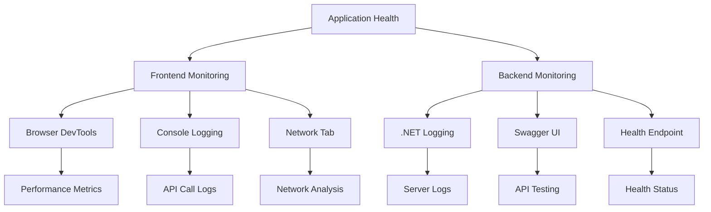
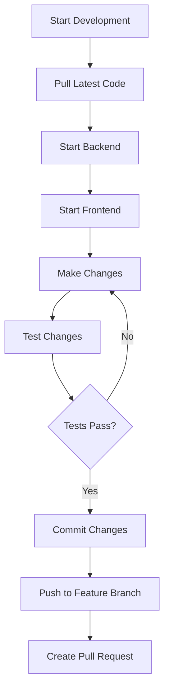

# 7. Deployment View

## 7.1 Development Environment Deployment

The application is designed for local development with a simple setup process.

### 7.1.1 Development Infrastructure



### 7.1.2 Development Deployment Process

| Step | Command | Purpose | Port |
|------|---------|---------|------|
| **1. Backend Start** | `cd backend/src/Api && dotnet run` | Start .NET API server | 5000 |
| **2. Frontend Start** | `cd frontend && npm run dev` | Start React dev server | 5173 |
| **3. Browser Access** | Open `http://localhost:5173` | Access application | 5173 |

### 7.1.3 Development Configuration



## 7.2 Local Development Setup

### 7.2.1 Prerequisites

| Requirement | Version | Purpose | Installation |
|-------------|---------|---------|--------------|
| **Node.js** | 18+ | Frontend development | [nodejs.org](https://nodejs.org) |
| **.NET SDK** | 9.0+ | Backend development | [dotnet.microsoft.com](https://dotnet.microsoft.com) |
| **Git** | Latest | Version control | [git-scm.com](https://git-scm.com) |
| **VS Code** | Latest | Development environment | [code.visualstudio.com](https://code.visualstudio.com) |

### 7.2.2 Installation Flow



### 7.2.3 Development Scripts

```bash
# Backend Commands
cd backend/src/Api
dotnet restore          # Install dependencies
dotnet build           # Build application
dotnet run             # Start development server

# Frontend Commands
cd frontend
npm install            # Install dependencies
npm run dev           # Start development server
npm run build         # Build for production
npm run lint          # Run linting
```

## 7.3 Network Configuration

### 7.3.1 Port Allocation



### 7.3.2 CORS Configuration

| Configuration | Development | Production Notes |
|---------------|-------------|------------------|
| **Allowed Origins** | `http://localhost:5173` | Restrict to actual domains |
| **Allowed Methods** | `GET, POST, PUT, DELETE` | Limit to required methods |
| **Allowed Headers** | `*` | Specify required headers only |
| **Credentials** | `false` | Enable only if needed |

## 7.4 Environment Configuration

### 7.4.1 Frontend Environment

**File: [`vite.config.ts`](../frontend/vite.config.ts)**

```typescript
export default defineConfig({
  plugins: [react()],
  server: {
    port: 5173,
    host: true,
    open: true,
  },
});
```

**Key Settings:**

- Port 5173 for development server
- Host binding for network access
- Auto-open browser on start

### 7.4.2 Backend Environment

**File: [`launchSettings.json`](../backend/src/Api/Properties/launchSettings.json)**

```json
{
  "profiles": {
    "http": {
      "commandName": "Project",
      "dotnetRunMessages": true,
      "launchBrowser": true,
      "applicationUrl": "http://localhost:5000",
      "environmentVariables": {
        "ASPNETCORE_ENVIRONMENT": "Development"
      }
    }
  }
}
```

**Key Settings:**

- Port 5000 for API server
- Development environment
- Swagger UI enabled

## 7.5 Production Deployment Considerations

### 7.5.1 Frontend Production Deployment



### 7.5.2 Backend Production Deployment



### 7.5.3 Production Configuration Changes

| Component | Development | Production Required Changes |
|-----------|-------------|----------------------------|
| **CORS Policy** | Permissive localhost | Restrict to actual domains |
| **HTTPS** | HTTP only | Enforce HTTPS everywhere |
| **Logging** | Console output | Structured logging to files/services |
| **Error Handling** | Detailed errors | Generic error messages |
| **Security Headers** | Basic | Full security header suite |
| **Build Optimization** | Development builds | Minified, optimized bundles |

## 7.6 Monitoring and Health Checks

### 7.6.1 Development Monitoring



### 7.6.2 Health Check Endpoints

| Endpoint | Method | Purpose | Response |
|----------|--------|---------|----------|
| `/api/health` | GET | Application health | `{"utcNow": "...", "status": "OK"}` |
| `/swagger` | GET | API documentation | Swagger UI |
| `/` | GET | Root endpoint | Swagger UI redirect |

## 7.7 Development Workflow

### 7.7.1 Daily Development Process



### 7.7.2 Hot Reload Configuration

| Technology | Configuration | Benefit |
|------------|---------------|---------|
| **Vite HMR** | Automatic with Vite dev server | Instant frontend updates |
| **.NET Hot Reload** | `dotnet watch run` | Backend changes without restart |
| **Browser Sync** | Built into Vite | Automatic browser refresh |

---

**Navigation:** [← Runtime View](06-runtime-view.md) | [Cross-cutting Concepts →](08-cross-cutting-concepts.md)