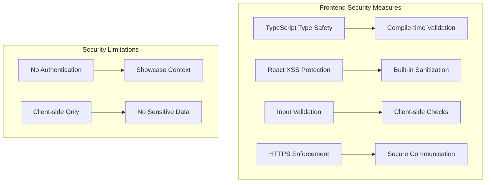
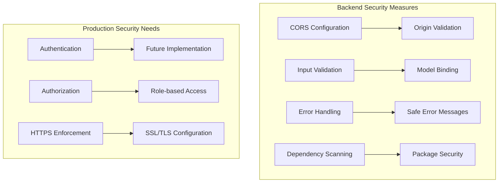
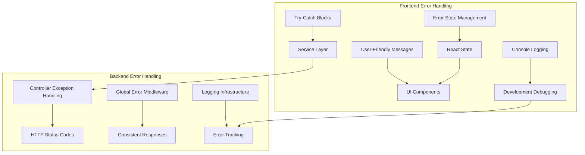
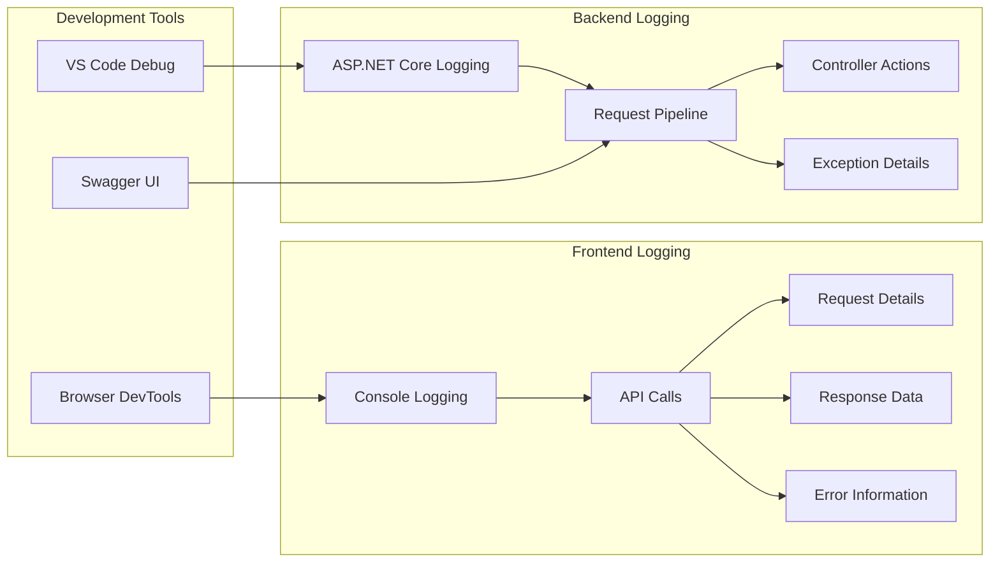
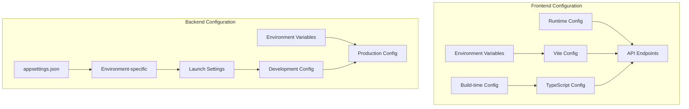
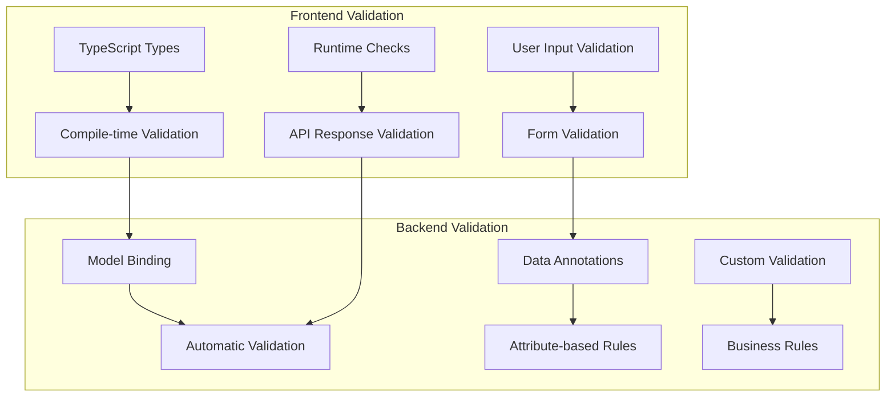
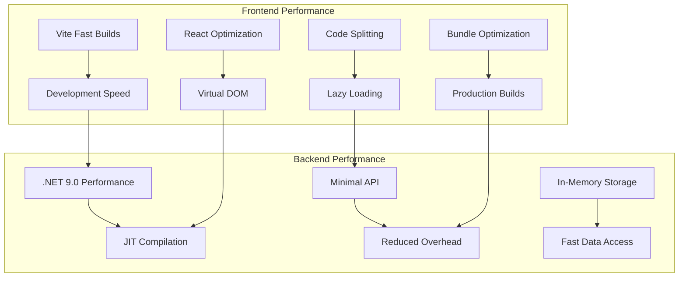
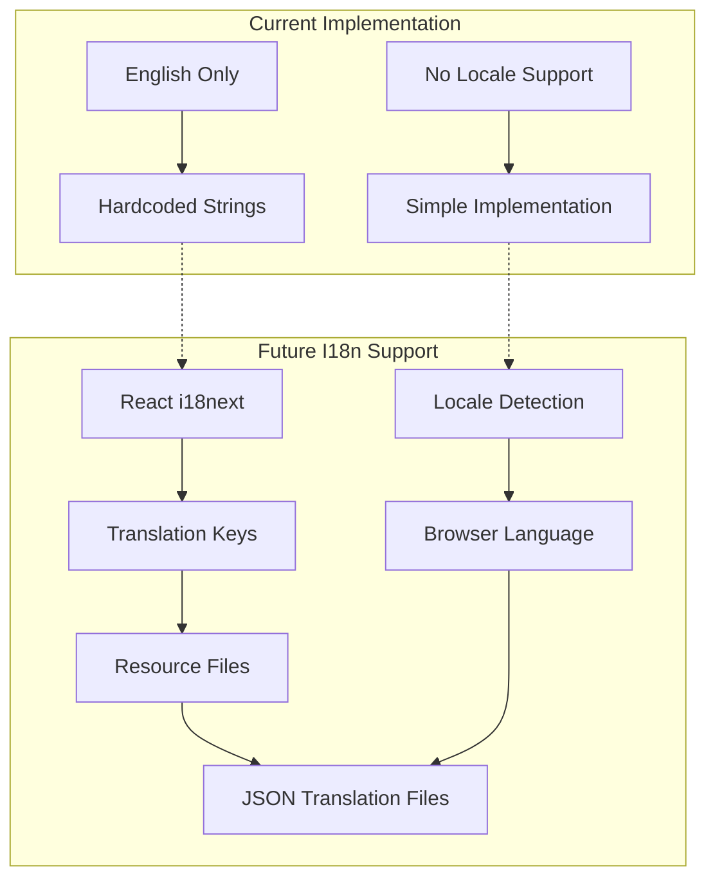
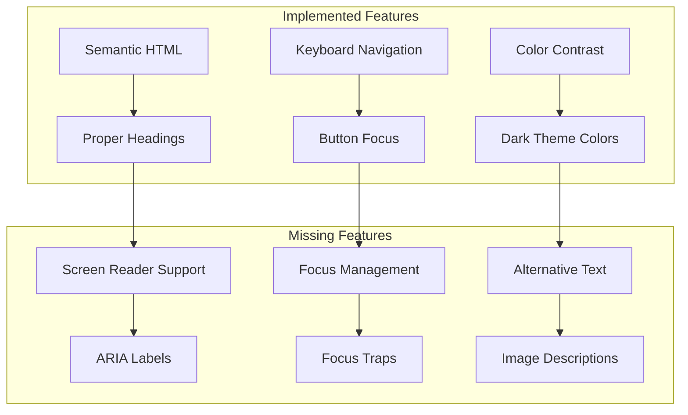

# 8. Cross-cutting Concepts

## 8.1 Security Concept

The application implements basic security measures appropriate for a showcase environment.

### 8.1.1 Frontend Security



**Frontend Security Implementation:**

| Security Aspect | Implementation | File Reference |
|------------------|----------------|----------------|
| **Type Safety** | TypeScript strict mode | [`tsconfig.json`](../frontend/tsconfig.json) |
| **XSS Prevention** | React's built-in protection | All `.tsx` components |
| **Input Validation** | TypeScript interfaces | [`health.ts`](../frontend/src/types/health.ts) |
| **Secure Requests** | Fetch API with validation | [`healthService.ts`](../frontend/src/services/healthService.ts) |

### 8.1.2 Backend Security



**Backend Security Implementation:**

| Security Aspect | Implementation | File Reference |
|------------------|----------------|----------------|
| **CORS Policy** | ASP.NET Core CORS middleware | [`Program.cs`](../backend/src/Api/Program.cs) |
| **Input Validation** | Model validation attributes | [`HealthTimeDto.cs`](../backend/src/Application/DTOs/HealthTimeDto.cs) |
| **Error Handling** | Global exception handling | Controller implementations |
| **Dependency Security** | NuGet package management | `.csproj` files |

## 8.2 Error Handling

### 8.2.1 Error Handling Strategy



### 8.2.2 Error Categories and Handling

| Error Type | Frontend Handling | Backend Handling | User Experience |
|------------|-------------------|------------------|-----------------|
| **Network Errors** | Catch in service layer | N/A | "Connection failed" message |
| **API Errors** | Parse HTTP status | Return error codes | Specific error display |
| **Validation Errors** | TypeScript validation | Model validation | Field-specific feedback |
| **Runtime Errors** | Error boundaries | Exception middleware | Generic error message |

## 8.3 Logging and Monitoring

### 8.3.1 Logging Strategy



### 8.3.2 Logging Implementation

**Frontend Logging Pattern:**

```typescript
// Console logging in healthService.ts
console.log(`🚀 API Call: ${method} ${url}`);
console.log('📋 Request details:', requestDetails);
console.log('✅ API Success:', data);
console.error('❌ API Error:', error);
```

**Backend Logging Configuration:**

```csharp
// Built-in ASP.NET Core logging
builder.Services.AddLogging();
// Configured in Program.cs
```

## 8.4 Configuration Management

### 8.4.1 Configuration Strategy



### 8.4.2 Configuration Files

| Configuration | File | Purpose | Environment |
|---------------|------|---------|-------------|
| **Frontend Build** | [`vite.config.ts`](../frontend/vite.config.ts) | Build and dev server settings | Development |
| **TypeScript** | [`tsconfig.json`](../frontend/tsconfig.json) | Compiler options | All |
| **Backend Launch** | [`launchSettings.json`](../backend/src/Api/Properties/launchSettings.json) | Development server settings | Development |
| **Package Dependencies** | [`package.json`](../frontend/package.json), `.csproj` | Dependency management | All |

## 8.5 Data Validation

### 8.5.1 Validation Strategy



### 8.5.2 Validation Implementation

**Frontend Type Validation:**

```typescript
interface HealthResponse {
  utcNow: string;
  status: string;
}
```

**Backend Model Validation:**

```csharp
public sealed record HealthTimeDto(DateTime UtcNow, string Status);
```

## 8.6 Performance Concepts

### 8.6.1 Performance Strategy



### 8.6.2 Performance Targets

| Metric | Target | Measurement | Current Status |
|--------|--------|-------------|----------------|
| **Build Time** | < 30 seconds | Vite build process | ✅ Achieved |
| **API Response** | < 100ms | Health endpoint | ✅ Achieved |
| **Page Load** | < 2 seconds | Initial render | ✅ Achieved |
| **Hot Reload** | < 1 second | Code change to browser | ✅ Achieved |

## 8.7 Internationalization (Future)

### 8.7.1 I18n Readiness



### 8.7.2 I18n Preparation

| Component | Current State | I18n Readiness | Future Implementation |
|-----------|---------------|----------------|----------------------|
| **UI Labels** | Hardcoded English | Low | Extract to translation keys |
| **Error Messages** | English strings | Low | Localized error handling |
| **Date Formatting** | Browser default | Medium | Locale-aware formatting |
| **API Messages** | English only | Low | Multi-language responses |

## 8.8 Accessibility (a11y)

### 8.8.1 Accessibility Current State



### 8.8.2 Accessibility Checklist

| Feature | Status | Implementation | Priority |
|---------|--------|----------------|----------|
| **Semantic HTML** | ✅ Implemented | Proper heading structure | High |
| **Keyboard Navigation** | ✅ Implemented | Native button focus | High |
| **Color Contrast** | ✅ Implemented | Dark theme compliance | High |
| **Screen Reader** | ❌ Missing | ARIA labels needed | Medium |
| **Focus Management** | ❌ Missing | Focus indicators | Medium |
| **Alternative Text** | ❌ Missing | Image descriptions | Low |

---

**Navigation:** [← Deployment View](07-deployment-view.md) | [Architecture Decisions →](09-architecture-decisions.md)