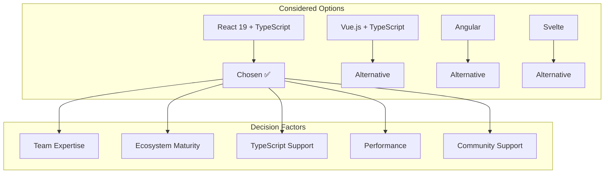
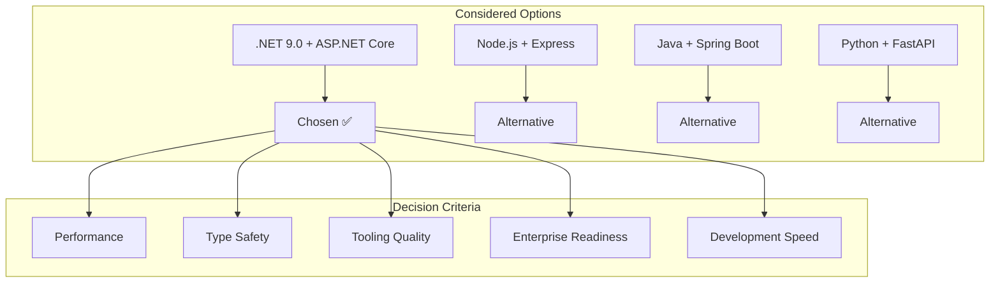
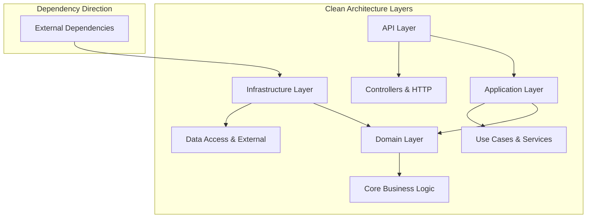
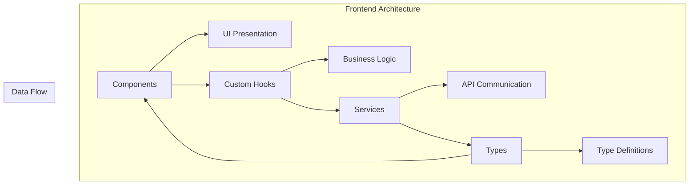
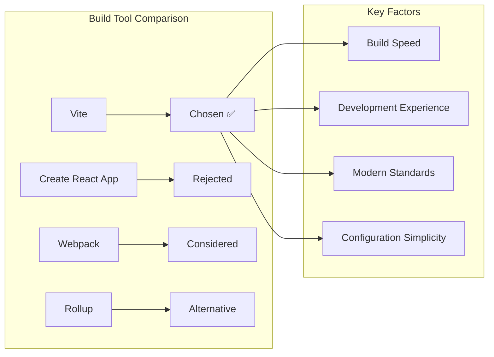
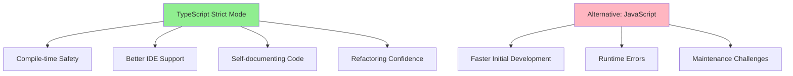
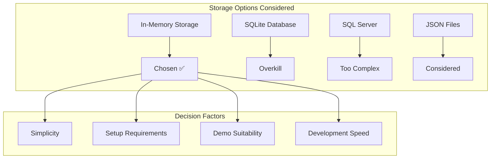
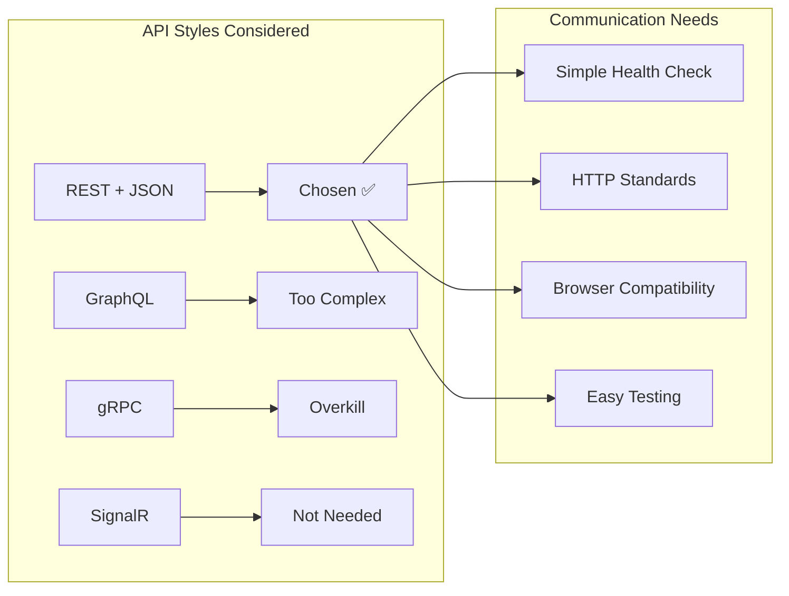
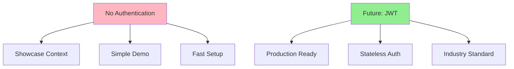
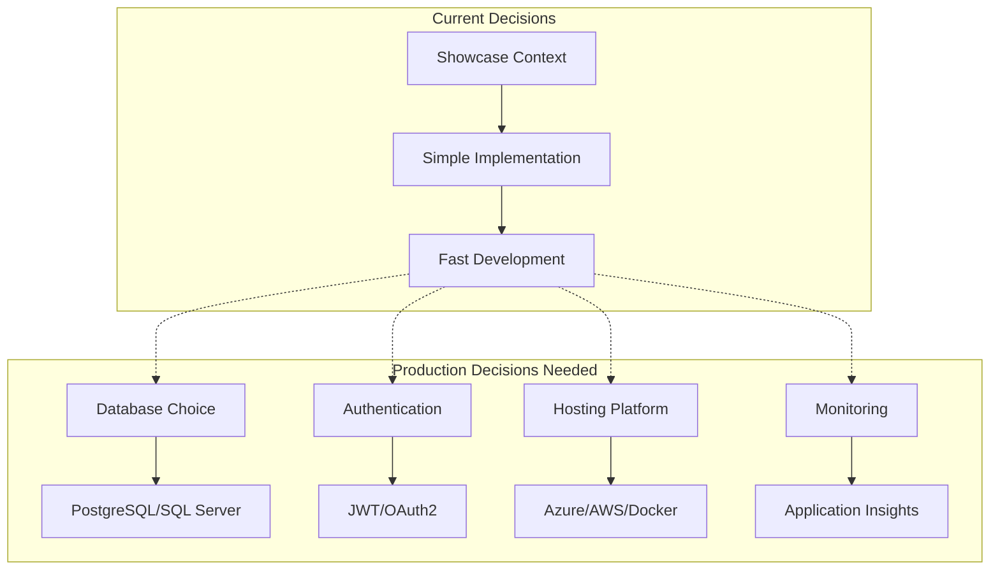

# 9. Architecture Decisions

## 9.1 Technology Stack Decisions

### 9.1.1 Frontend Technology Decision

**Decision:** Use React 19 with TypeScript and Vite for the frontend



**Rationale:**

| Factor | React 19 + TypeScript | Vue.js | Angular | Svelte |
|--------|----------------------|--------|---------|---------|
| **Learning Curve** | ✅ Moderate | ✅ Low | ❌ High | ✅ Low |
| **TypeScript Support** | ✅ Excellent | ✅ Good | ✅ Native | ⚠️ Growing |
| **Ecosystem** | ✅ Mature | ✅ Good | ✅ Comprehensive | ⚠️ Developing |
| **Performance** | ✅ Excellent | ✅ Good | ✅ Good | ✅ Excellent |
| **Job Market** | ✅ High demand | ⚠️ Growing | ✅ Enterprise | ⚠️ Niche |

**Consequences:**
- **Positive:** Strong TypeScript integration, large ecosystem, excellent tooling
- **Negative:** Steeper learning curve than some alternatives, frequent updates
- **Neutral:** Well-established patterns, good documentation

### 9.1.2 Backend Technology Decision

**Decision:** Use .NET 9.0 with ASP.NET Core for the backend



**Rationale:**

| Factor | .NET 9.0 | Node.js | Java Spring | Python FastAPI |
|--------|----------|---------|-------------|----------------|
| **Performance** | ✅ Excellent | ✅ Good | ✅ Good | ⚠️ Moderate |
| **Type Safety** | ✅ Strong | ⚠️ TypeScript | ✅ Strong | ⚠️ Optional |
| **Tooling** | ✅ Excellent | ✅ Good | ✅ Mature | ✅ Good |
| **Learning Curve** | ⚠️ Moderate | ✅ Low | ❌ High | ✅ Low |
| **Enterprise Use** | ✅ High | ✅ High | ✅ Very High | ⚠️ Growing |

**Consequences:**
- **Positive:** Excellent performance, strong typing, comprehensive tooling
- **Negative:** Microsoft ecosystem dependency, licensing considerations
- **Neutral:** Mature platform with long-term support

## 9.2 Architectural Pattern Decisions

### 9.2.1 Clean Architecture Decision

**Decision:** Implement Clean Architecture pattern for the backend



**Rationale:**

| Aspect | Clean Architecture | MVC | N-Tier | Hexagonal |
|--------|-------------------|-----|---------|-----------|
| **Testability** | ✅ Excellent | ⚠️ Moderate | ⚠️ Limited | ✅ Excellent |
| **Maintainability** | ✅ High | ⚠️ Moderate | ❌ Low | ✅ High |
| **Flexibility** | ✅ High | ⚠️ Moderate | ❌ Low | ✅ High |
| **Learning Curve** | ⚠️ Steep | ✅ Familiar | ✅ Simple | ⚠️ Moderate |
| **Project Size** | ✅ Scales well | ⚠️ Small-Medium | ❌ Limited | ✅ Scales well |

**Consequences:**
- **Positive:** High testability, clear separation of concerns, independent of frameworks
- **Negative:** More complex initial setup, requires discipline to maintain
- **Neutral:** Well-documented pattern with established practices

### 9.2.2 Frontend Architecture Decision

**Decision:** Use Component-Hook-Service pattern for frontend architecture



**Rationale:**

| Pattern | Chosen Approach | Redux | Context API | MobX |
|---------|-----------------|-------|-------------|------|
| **Complexity** | ✅ Simple | ❌ Complex | ✅ Simple | ⚠️ Moderate |
| **Learning Curve** | ✅ Low | ❌ High | ✅ Low | ⚠️ Moderate |
| **Boilerplate** | ✅ Minimal | ❌ Heavy | ✅ Minimal | ✅ Light |
| **Debugging** | ✅ Good | ✅ Excellent | ⚠️ Limited | ✅ Good |
| **Performance** | ✅ Good | ✅ Good | ⚠️ Re-renders | ✅ Excellent |

**Consequences:**
- **Positive:** Simple to understand, minimal boilerplate, good for small applications
- **Negative:** May not scale for large applications, limited global state management
- **Neutral:** Leverages React's built-in capabilities

## 9.3 Development Tool Decisions

### 9.3.1 Build Tool Decision

**Decision:** Use Vite for frontend build tooling



**Rationale:**

| Factor | Vite | CRA | Webpack | Rollup |
|--------|------|-----|---------|---------|
| **Build Speed** | ✅ Fastest | ❌ Slow | ⚠️ Moderate | ✅ Fast |
| **Dev Server** | ✅ Instant HMR | ⚠️ Slower | ⚠️ Configuration | ⚠️ Plugin dependent |
| **Configuration** | ✅ Minimal | ✅ Zero config | ❌ Complex | ⚠️ Moderate |
| **Modern Features** | ✅ ES modules | ⚠️ Legacy | ✅ Configurable | ✅ ES modules |
| **Ecosystem** | ✅ Growing | ✅ Mature | ✅ Extensive | ⚠️ Smaller |

**Consequences:**
- **Positive:** Fast development builds, excellent HMR, minimal configuration
- **Negative:** Newer tool with potentially changing APIs
- **Neutral:** Good documentation and community support

### 9.3.2 Type System Decision

**Decision:** Use TypeScript with strict mode enabled



**Rationale:**

| Aspect | TypeScript Strict | TypeScript Loose | JavaScript |
|--------|------------------|------------------|------------|
| **Type Safety** | ✅ Maximum | ⚠️ Partial | ❌ Runtime only |
| **Development Speed** | ⚠️ Initial overhead | ✅ Faster | ✅ Fastest |
| **Maintenance** | ✅ Excellent | ✅ Good | ❌ Challenging |
| **Refactoring** | ✅ Safe | ⚠️ Risky | ❌ Manual |
| **Learning Curve** | ⚠️ Steep | ✅ Moderate | ✅ Familiar |

**Consequences:**
- **Positive:** Catch errors at compile time, excellent IDE support, self-documenting
- **Negative:** Longer initial development time, requires type definitions
- **Neutral:** Industry standard for large applications

## 9.4 Data Storage Decisions

### 9.4.1 Data Persistence Decision

**Decision:** Use in-memory storage for showcase purposes



**Rationale:**

| Factor | In-Memory | SQLite | SQL Server | JSON Files |
|--------|-----------|--------|------------|------------|
| **Setup Complexity** | ✅ None | ⚠️ Minimal | ❌ High | ✅ Simple |
| **Demo Suitability** | ✅ Perfect | ⚠️ Overkill | ❌ Overkill | ✅ Good |
| **Performance** | ✅ Fastest | ✅ Fast | ✅ Fast | ⚠️ File I/O |
| **Persistence** | ❌ None | ✅ Yes | ✅ Yes | ✅ Yes |
| **Scalability** | ❌ Limited | ⚠️ Light use | ✅ Enterprise | ❌ Not scalable |

**Consequences:**
- **Positive:** Zero setup, perfect for demos, fastest performance
- **Negative:** No data persistence, not suitable for production
- **Neutral:** Matches the showcase context and goals

### 9.4.2 API Design Decision

**Decision:** Use REST API with JSON for communication



**Rationale:**

| Factor | REST + JSON | GraphQL | gRPC | SignalR |
|--------|-------------|---------|------|---------|
| **Complexity** | ✅ Simple | ❌ Complex | ❌ Complex | ⚠️ Moderate |
| **Browser Support** | ✅ Native | ✅ HTTP | ⚠️ Requires proxy | ✅ Good |
| **Tooling** | ✅ Excellent | ✅ Good | ⚠️ Limited | ✅ Good |
| **Learning Curve** | ✅ Low | ⚠️ Moderate | ❌ High | ⚠️ Moderate |
| **Use Case Fit** | ✅ Perfect | ❌ Overkill | ❌ Overkill | ❌ Not needed |

**Consequences:**
- **Positive:** Simple to implement, excellent tooling, universal support
- **Negative:** Less efficient than binary protocols, limited query flexibility
- **Neutral:** Industry standard for web APIs

## 9.5 Security Decisions

### 9.5.1 Authentication Decision

**Decision:** No authentication for showcase context



**Rationale:**

| Factor | No Auth | JWT | Cookie Auth | OAuth2 |
|--------|---------|-----|-------------|---------|
| **Setup Complexity** | ✅ None | ⚠️ Moderate | ⚠️ Moderate | ❌ High |
| **Demo Suitability** | ✅ Perfect | ❌ Unnecessary | ❌ Unnecessary | ❌ Overkill |
| **Security** | ❌ None | ✅ Good | ✅ Good | ✅ Excellent |
| **Production Ready** | ❌ No | ✅ Yes | ✅ Yes | ✅ Yes |
| **Development Speed** | ✅ Fastest | ⚠️ Slower | ⚠️ Slower | ❌ Slowest |

**Consequences:**
- **Positive:** Zero setup complexity, perfect for demonstration
- **Negative:** Not production-ready, no access control
- **Neutral:** Appropriate for the current context and goals

### 9.5.2 CORS Policy Decision

**Decision:** Permissive CORS for development, restrictive for production

**Current Implementation:**

```csharp
builder.Services.AddCors(options =>
{
    options.AddPolicy("AllowFrontend",
        builder => builder
            .WithOrigins("http://localhost:5173")
            .AllowAnyMethod()
            .AllowAnyHeader());
});
```

**Rationale:**
- **Development:** Allow frontend development on different port
- **Production:** Would need restriction to actual domain origins
- **Security Balance:** Secure enough for demo, configurable for production

## 9.6 Decision Summary

### 9.6.1 Key Architectural Decisions

| Decision Area | Choice | Rationale | Impact |
|---------------|--------|-----------|---------|
| **Frontend Framework** | React 19 + TypeScript | Mature ecosystem, excellent TypeScript support | High development velocity |
| **Backend Framework** | .NET 9.0 + ASP.NET Core | Performance, type safety, tooling | Robust, scalable foundation |
| **Architecture Pattern** | Clean Architecture | Testability, maintainability | Higher initial complexity, better long-term |
| **Build Tool** | Vite | Fast builds, excellent DX | Rapid development feedback |
| **Data Storage** | In-Memory | Showcase simplicity | Not production-ready |
| **API Style** | REST + JSON | Simplicity, standards compliance | Universal compatibility |
| **Authentication** | None | Demo context | Not production-ready |

### 9.6.2 Future Decision Points



---

**Navigation:** [← Cross-cutting Concepts](08-cross-cutting-concepts.md) | [Quality Requirements →](10-quality-requirements.md)