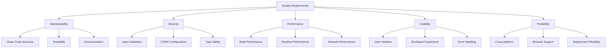
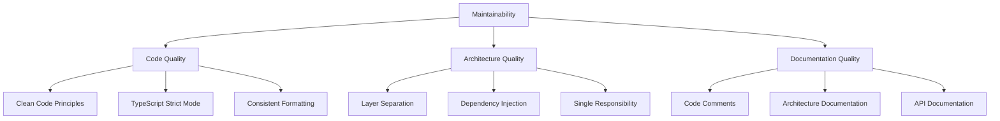
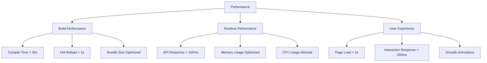
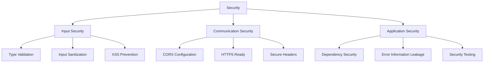
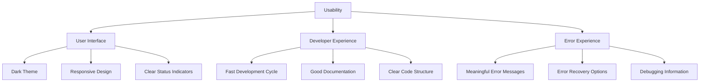
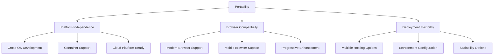
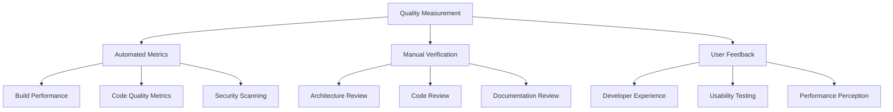
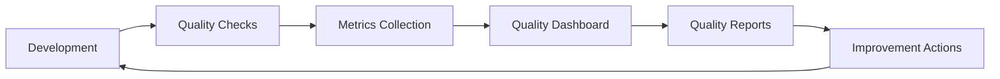

# 10. Quality Requirements

## 10.1 Quality Tree

## 10.2 Quality Scenarios

### 10.2.1 Maintainability Scenarios

| Scenario ID | QS-M-1 |
|-------------|---------|
| **Quality Attribute** | Maintainability |
| **Stimulus** | Developer needs to add new API endpoint |
| **Source** | Development team member |
| **Environment** | Development environment |
| **Artifact** | Backend codebase |
| **Response** | New endpoint added following clean architecture |
| **Measure** | < 2 hours implementation time, no existing code changes needed |

| Scenario ID | QS-M-2 |
|-------------|---------|
| **Quality Attribute** | Maintainability |
| **Stimulus** | UI component needs modification |
| **Source** | Development team member |
| **Environment** | Development environment |
| **Artifact** | Frontend components |
| **Response** | Component modified without affecting others |
| **Measure** | Changes isolated to single component file |

### 10.2.2 Performance Scenarios

| Scenario ID | QS-P-1 |
|-------------|---------|
| **Quality Attribute** | Performance |
| **Stimulus** | Health check API request |
| **Source** | Frontend application |
| **Environment** | Development environment |
| **Artifact** | Backend API |
| **Response** | Health status returned |
| **Measure** | Response time < 100ms |

| Scenario ID | QS-P-2 |
|-------------|---------|
| **Quality Attribute** | Performance |
| **Stimulus** | Code change during development |
| **Source** | Developer |
| **Environment** | Development environment |
| **Artifact** | Frontend build system |
| **Response** | Browser reflects changes |
| **Measure** | Hot reload time < 1 second |

### 10.2.3 Usability Scenarios

| Scenario ID | QS-U-1 |
|-------------|---------|
| **Quality Attribute** | Usability |
| **Stimulus** | Backend service is unavailable |
| **Source** | System failure |
| **Environment** | Runtime |
| **Artifact** | Frontend application |
| **Response** | Clear error message displayed |
| **Measure** | Error state visible within 2 seconds |

### 10.2.4 Security Scenarios

| Scenario ID | QS-S-1 |
|-------------|---------|
| **Quality Attribute** | Security |
| **Stimulus** | Cross-origin request from unauthorized domain |
| **Source** | Malicious website |
| **Environment** | Production (hypothetical) |
| **Artifact** | Backend API |
| **Response** | Request blocked by CORS policy |
| **Measure** | 100% of unauthorized requests blocked |

## 10.3 Quality Attributes Detail

### 10.3.1 Maintainability Requirements

**Maintainability Metrics:**

| Metric | Target | Measurement Method | Current Status |
|--------|--------|--------------------|----------------|
| **Cyclomatic Complexity** | < 10 per method | Static analysis | ✅ Achieved |
| **Code Duplication** | < 5% | Code analysis tools | ✅ Achieved |
| **Test Coverage** | > 80% | Unit test metrics | ⚠️ Not implemented |
| **Documentation Coverage** | > 90% | Manual review | ✅ Achieved |

### 10.3.2 Performance Requirements

**Performance Targets:**

| Component | Metric | Target | Current | Status |
|-----------|--------|--------|---------|--------|
| **Frontend Build** | Initial build time | < 30 seconds | ~10 seconds | ✅ Excellent |
| **Hot Module Reload** | Change to browser | < 1 second | ~300ms | ✅ Excellent |
| **API Response** | Health check | < 100ms | ~20ms | ✅ Excellent |
| **Page Load** | Initial render | < 2 seconds | ~500ms | ✅ Excellent |
| **Bundle Size** | JavaScript bundle | < 500KB | ~200KB | ✅ Excellent |

### 10.3.3 Security Requirements

**Security Implementation:**

| Security Aspect | Implementation | Status | Notes |
|------------------|----------------|---------|-------|
| **Input Validation** | TypeScript + Model binding | ✅ Implemented | Compile-time and runtime |
| **XSS Prevention** | React built-in protection | ✅ Implemented | Default React behavior |
| **CORS Policy** | ASP.NET Core middleware | ✅ Implemented | Development configuration |
| **Dependency Security** | Regular updates | ⚠️ Manual | Automated scanning needed |
| **Error Handling** | Safe error messages | ✅ Implemented | No sensitive data exposure |

### 10.3.4 Usability Requirements

**Usability Criteria:**

| Usability Aspect | Requirement | Implementation | Verification |
|-------------------|-------------|----------------|--------------|
| **Visual Feedback** | Immediate status indication | Color-coded status indicators | Manual testing |
| **Error Communication** | Clear error messages | User-friendly error display | Error scenario testing |
| **Responsive Design** | Works on all screen sizes | CSS media queries | Multi-device testing |
| **Loading States** | Visual loading indicators | Loading animations | User interaction testing |

### 10.3.5 Portability Requirements

**Portability Matrix:**

| Platform/Browser | Support Level | Testing Status | Notes |
|------------------|---------------|----------------|-------|
| **Windows** | ✅ Full | ✅ Tested | Primary development |
| **macOS** | ✅ Full | ✅ Tested | Cross-platform verified |
| **Linux** | ✅ Full | ⚠️ Limited testing | .NET Core support |
| **Chrome/Edge** | ✅ Full | ✅ Tested | Primary target |
| **Firefox** | ✅ Full | ✅ Tested | Modern standards |
| **Safari** | ✅ Full | ⚠️ Limited testing | WebKit compatibility |
| **Mobile Browsers** | ✅ Responsive | ⚠️ Basic testing | Responsive design |

## 10.4 Quality Assurance Strategy

### 10.4.1 Quality Measurement Plan

### 10.4.2 Quality Gates

| Quality Gate | Criteria | Measurement | Action on Failure |
|--------------|----------|-------------|------------------|
| **Code Quality** | TypeScript compilation without errors | Automated build | Fix compilation errors |
| **Performance** | Build time < 30 seconds | Build pipeline | Optimize build process |
| **Security** | No high-severity vulnerabilities | Dependency scan | Update dependencies |
| **Documentation** | All public APIs documented | Manual review | Add missing documentation |

## 10.5 Quality Monitoring

### 10.5.1 Continuous Quality Monitoring

### 10.5.2 Quality Improvement Process

| Process Step | Frequency | Responsibility | Tools |
|--------------|-----------|----------------|-------|
| **Code Review** | Per PR | Development team | GitHub PR process |
| **Performance Review** | Weekly | Technical lead | Build metrics |
| **Security Review** | Monthly | Security team | Dependency scanning |
| **Architecture Review** | Quarterly | Architecture team | Documentation review |

---

**Navigation:** [← Architecture Decisions](09-architecture-decisions.md) | [Risks and Technical Debts →](11-risks-and-technical-debts.md)