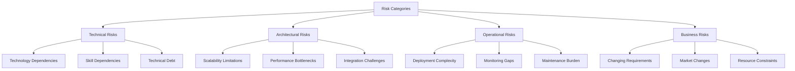
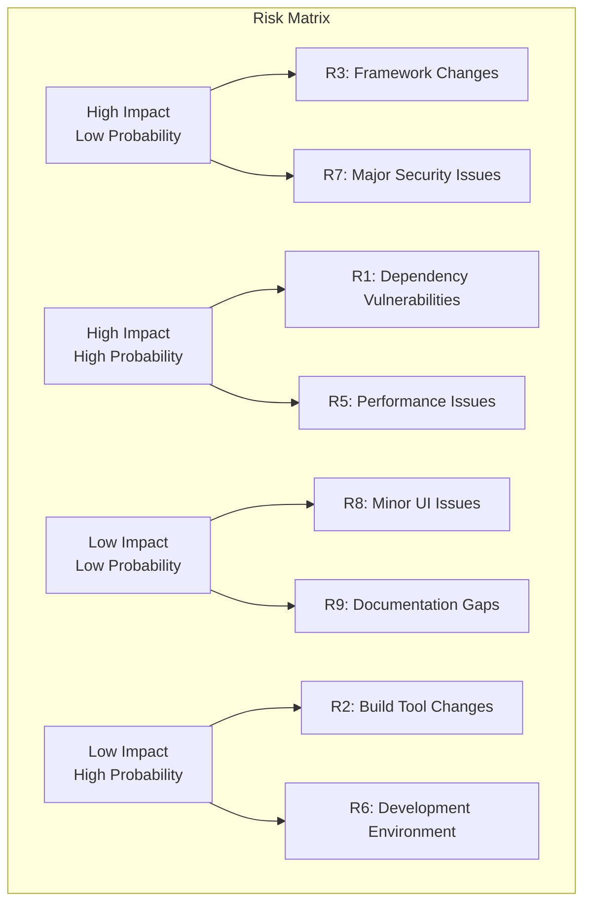
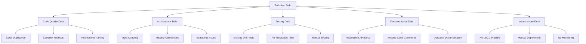
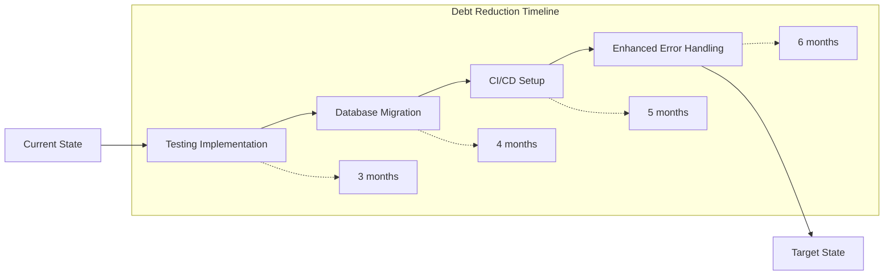
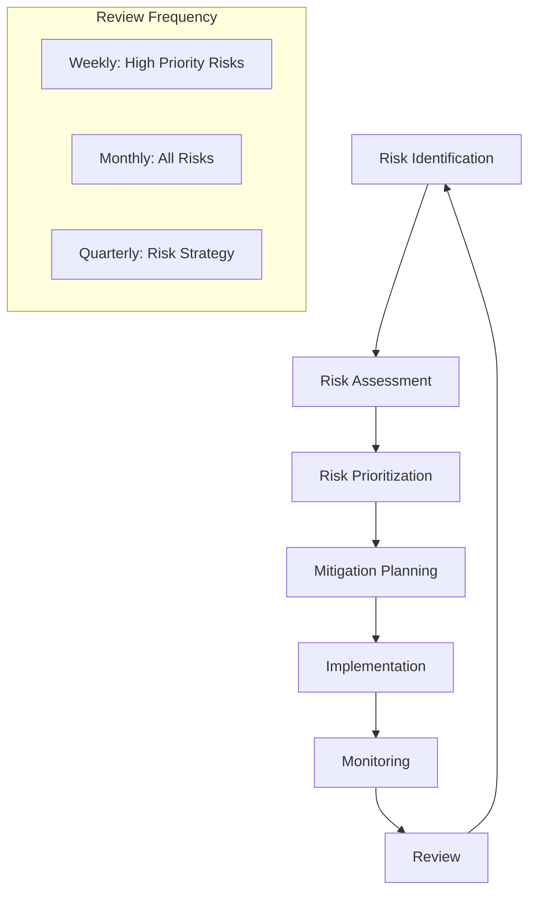
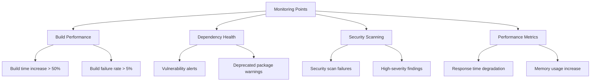
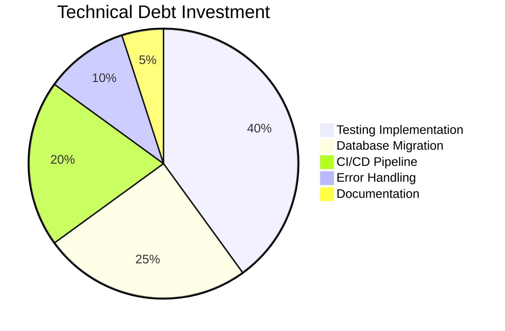

# 11. Risks and Technical Debts

## 11.1 Risk Assessment Overview

## 11.2 Risk Analysis Matrix

### 11.2.1 Risk Probability vs Impact Matrix

## 11.3 Identified Risks

### 11.3.1 High Priority Risks

#### Risk R1: Dependency Vulnerabilities

| **Risk ID** | R1 |
|-------------|-----|
| **Risk Title** | Third-party Dependency Security Vulnerabilities |
| **Category** | Security / Technical |
| **Probability** | High (80%) |
| **Impact** | High |
| **Risk Level** | 🔴 Critical |

**Description:**
The application relies on numerous third-party packages (npm packages for frontend, NuGet packages for backend) that may contain security vulnerabilities.

**Risk Factors:**
- 50+ npm dependencies in frontend
- 20+ NuGet packages in backend
- Automatic transitive dependency resolution
- Rapid release cycles of dependencies

**Potential Consequences:**
- Security vulnerabilities in production
- Data breach or system compromise
- Compliance violations
- Emergency patching requirements

**Mitigation Strategies:**
- [ ] Implement automated dependency scanning (e.g., Dependabot, Snyk)
- [ ] Regular dependency updates schedule
- [ ] Security vulnerability monitoring
- [ ] Dependency pinning for critical packages
- [ ] Security testing in CI/CD pipeline

**Contingency Plans:**
- Emergency update procedures
- Vulnerability assessment protocols
- Incident response plan
- Rollback procedures

#### Risk R2: Framework Evolution and Breaking Changes

| **Risk ID** | R2 |
|-------------|-----|
| **Risk Title** | Major Framework Version Updates |
| **Category** | Technical / Architectural |
| **Probability** | Medium (50%) |
| **Impact** | High |
| **Risk Level** | 🟡 High |

**Description:**
React 19 and .NET 9.0 are relatively new versions that may have breaking changes in future updates.

**Risk Factors:**
- Using latest versions of frameworks
- Rapid evolution of web technologies
- Potential deprecation of features
- Limited long-term support guarantees

**Potential Consequences:**
- Code refactoring requirements
- Development delays
- Compatibility issues
- Training needs for team

**Mitigation Strategies:**
- [ ] Follow framework roadmaps closely
- [ ] Gradual migration strategies
- [ ] Feature flag implementation
- [ ] Comprehensive test coverage
- [ ] Documentation of framework-specific code

#### Risk R3: Performance Scalability Limitations

| **Risk ID** | R3 |
|-------------|-----|
| **Risk Title** | Application Performance Under Load |
| **Category** | Performance / Scalability |
| **Probability** | Medium (40%) |
| **Impact** | Medium |
| **Risk Level** | 🟡 Medium |

**Description:**
Current in-memory storage and simple architecture may not scale beyond demonstration purposes.

**Risk Factors:**
- In-memory data storage
- Single-instance deployment
- No caching mechanisms
- No load balancing

**Potential Consequences:**
- Poor user experience under load
- System crashes
- Data loss (in-memory storage)
- Scalability bottlenecks

**Mitigation Strategies:**
- [ ] Performance testing implementation
- [ ] Database migration planning
- [ ] Caching strategy development
- [ ] Load balancing consideration
- [ ] Performance monitoring setup

### 11.3.2 Medium Priority Risks

#### Risk R4: Development Environment Inconsistencies

| **Risk ID** | R4 |
|-------------|-----|
| **Risk Title** | Cross-Platform Development Issues |
| **Category** | Operational |
| **Probability** | Medium (60%) |
| **Impact** | Low |
| **Risk Level** | 🟡 Medium |

**Description:**
Development across different operating systems (Windows, macOS, Linux) may cause environment-specific issues.

**Risk Factors:**
- Multi-platform development team
- OS-specific tooling differences
- Path separator variations
- File system case sensitivity

**Mitigation Strategies:**
- [ ] Containerized development environment
- [ ] Cross-platform testing procedures
- [ ] Standardized development setup
- [ ] CI/CD environment validation

#### Risk R5: Knowledge Transfer and Bus Factor

| **Risk ID** | R5 |
|-------------|-----|
| **Risk Title** | Key Personnel Dependencies |
| **Category** | Organizational |
| **Probability** | Low (20%) |
| **Impact** | High |
| **Risk Level** | 🟡 Medium |

**Description:**
Critical knowledge concentrated in few team members, creating dependencies.

**Risk Factors:**
- Complex architectural decisions
- Framework-specific expertise
- Limited team size
- Specialized domain knowledge

**Mitigation Strategies:**
- [ ] Comprehensive documentation
- [ ] Knowledge sharing sessions
- [ ] Code review practices
- [ ] Cross-training initiatives

### 11.3.3 Low Priority Risks

#### Risk R6: Third-Party Service Dependencies

| **Risk ID** | R6 |
|-------------|-----|
| **Risk Title** | External Service Unavailability |
| **Category** | Operational |
| **Probability** | Low (15%) |
| **Impact** | Low |
| **Risk Level** | 🟢 Low |

**Description:**
Dependencies on external services (npm registry, NuGet, CDNs) for development and deployment.

**Mitigation Strategies:**
- [ ] Package caching
- [ ] Mirror services
- [ ] Offline development capabilities

## 11.4 Technical Debt Inventory

### 11.4.1 Technical Debt Categories

### 11.4.2 Current Technical Debt Items

#### TD1: Missing Test Coverage

| **Debt ID** | TD1 |
|-------------|-----|
| **Title** | Absence of Automated Testing |
| **Category** | Testing Debt |
| **Severity** | High |
| **Effort** | 2-3 weeks |
| **Interest Rate** | High - bugs may go undetected |

**Description:**
No unit tests, integration tests, or end-to-end tests implemented.

**Technical Impact:**
- Regression risk during development
- Difficult to refactor safely
- Manual testing overhead
- Quality assurance challenges

**Business Impact:**
- Potential production bugs
- Slower development velocity
- Increased maintenance costs
- Lower confidence in releases

**Remediation Plan:**
1. Set up testing frameworks (Jest, xUnit)
2. Implement unit tests for critical components
3. Add integration tests for API endpoints
4. Create end-to-end test scenarios
5. Integrate tests into development workflow

**Priority:** High - Essential for maintainable codebase

#### TD2: In-Memory Data Storage

| **Debt ID** | TD2 |
|-------------|-----|
| **Title** | Temporary In-Memory Data Storage |
| **Category** | Architectural Debt |
| **Severity** | Medium |
| **Effort** | 1-2 weeks |
| **Interest Rate** | Medium - limits scalability |

**Description:**
Current implementation uses in-memory storage instead of persistent database.

**Technical Impact:**
- Data loss on application restart
- No data persistence across deployments
- Memory consumption grows over time
- No concurrent access support

**Business Impact:**
- Limited to demonstration scenarios
- No production viability
- Scalability constraints
- Data reliability issues

**Remediation Plan:**
1. Choose appropriate database technology
2. Implement repository pattern properly
3. Add database migrations
4. Update configuration management
5. Add database health checks

**Priority:** Medium - Acceptable for showcase, critical for production

#### TD3: Missing CI/CD Pipeline

| **Debt ID** | TD3 |
|-------------|-----|
| **Title** | Manual Build and Deployment Process |
| **Category** | Infrastructure Debt |
| **Severity** | Medium |
| **Effort** | 1 week |
| **Interest Rate** | Medium - slows delivery |

**Description:**
No automated build, test, or deployment pipeline implemented.

**Technical Impact:**
- Manual deployment errors
- Inconsistent builds
- No automated quality gates
- Slow feedback cycles

**Business Impact:**
- Slower time to market
- Higher deployment risks
- Manual process overhead
- Inconsistent environments

**Remediation Plan:**
1. Set up GitHub Actions workflows
2. Implement automated testing
3. Add quality gates
4. Configure deployment automation
5. Add monitoring and alerting

**Priority:** Medium - Important for development efficiency

#### TD4: Limited Error Handling

| **Debt ID** | TD4 |
|-------------|-----|
| **Title** | Basic Error Handling Implementation |
| **Category** | Code Quality Debt |
| **Severity** | Low |
| **Effort** | 3-5 days |
| **Interest Rate** | Low - manageable for current scope |

**Description:**
Error handling is basic and may not cover all edge cases.

**Technical Impact:**
- Unhandled exceptions possible
- Poor error user experience
- Limited debugging information
- Inconsistent error responses

**Remediation Plan:**
1. Implement global error handling
2. Add error boundaries in React
3. Standardize error response format
4. Add error logging and monitoring
5. Improve error user experience

**Priority:** Low - Can be addressed incrementally

### 11.4.3 Technical Debt Trends

## 11.5 Risk Monitoring and Review

### 11.5.1 Risk Review Process

### 11.5.2 Risk Metrics and KPIs

| Risk Category | Metric | Current Status | Target | Trend |
|---------------|--------|----------------|---------|-------|
| **Security** | Vulnerability count | 0 known | 0 | ✅ Stable |
| **Dependencies** | Outdated packages | 5-10 | < 5 | ⚠️ Monitor |
| **Performance** | Response time | < 100ms | < 100ms | ✅ Good |
| **Quality** | Test coverage | 0% | > 80% | 🔴 Critical |
| **Documentation** | Completeness | 90% | > 95% | ✅ Good |

### 11.5.3 Early Warning Indicators

## 11.6 Debt Reduction Strategy

### 11.6.1 Debt Prioritization Framework

| Priority | Criteria | Action Required |
|----------|----------|-----------------|
| **Critical** | Blocks production deployment | Immediate action |
| **High** | Significantly impacts development | Address within sprint |
| **Medium** | Moderate impact on quality | Address within quarter |
| **Low** | Minor quality impact | Address when convenient |

### 11.6.2 Investment Allocation

---

**Navigation:** [← Quality Requirements](10-quality-requirements.md) | [Glossary →](12-glossary.md)