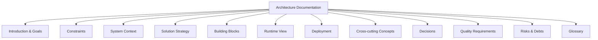
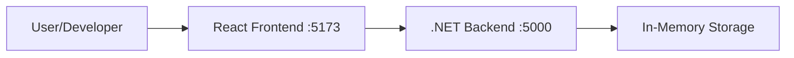

# Architecture Documentation - ghagent-showcase

This documentation follows the [arc42](https://arc42.org/) template for software architecture documentation.

## Overview

The ghagent-showcase is a full-stack application demonstrating clean architecture principles with a .NET Core backend and React frontend. This showcase emphasizes best practices in code organization, security, and maintainability.

## Table of Contents

1. [Introduction and Goals](01-introduction-and-goals.md)
2. [Architecture Constraints](02-architecture-constraints.md)
3. [System Scope and Context](03-system-scope-and-context.md)
4. [Solution Strategy](04-solution-strategy.md)
5. [Building Block View](05-building-block-view.md)
6. [Runtime View](06-runtime-view.md)
7. [Deployment View](07-deployment-view.md)
8. [Cross-cutting Concepts](08-cross-cutting-concepts.md)
9. [Architecture Decisions](09-architecture-decisions.md)
10. [Quality Requirements](10-quality-requirements.md)
11. [Risks and Technical Debts](11-risks-and-technical-debts.md)
12. [Glossary](12-glossary.md)

## Quick Navigation

## System Overview

**Technology Stack:**
- Frontend: React 19 + TypeScript + Vite
- Backend: .NET 9.0 + ASP.NET Core
- Development: Local development environment

**Key Features:**
- Health check dashboard
- Clean architecture implementation
- Dark mode UI design
- Console logging for API calls
- CORS-enabled development setup

---

*Last updated: October 17, 2025*